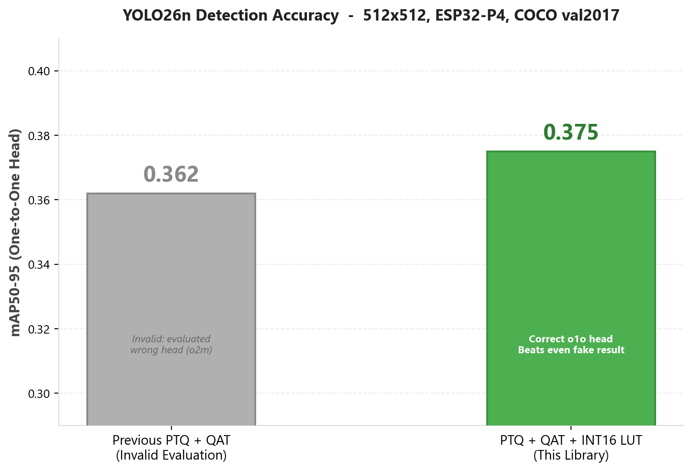
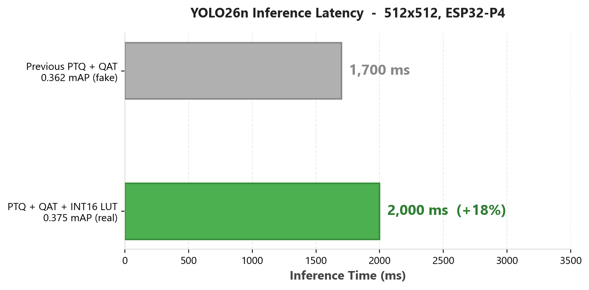
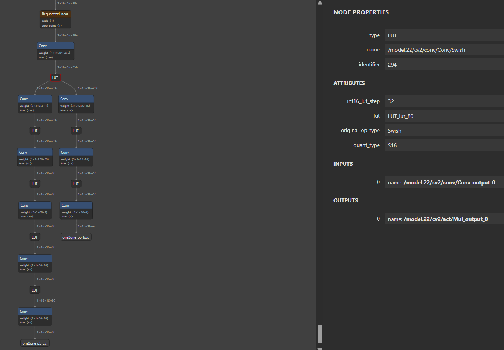

# ESP-PPQ LUT   Bit-Exact LUT Activation Deployment for ESP32

> **A Python extension library for [esp-ppq](https://github.com/espressif/esp-ppq) that enables bit-exact Look-Up Table (LUT) based activation functions for INT16 quantized neural networks on ESP32-P4 and ESP32-S3.**

---

## Table of Contents

- [Motivation   Why This Exists](#motivation--why-this-exists)
  - [The YOLO26n Deployment Challenge](#the-yolo26n-deployment-challenge)
  - [The Simulation Gap](#the-simulation-gap)
  - [The Fencepost Bug](#the-fencepost-bug)
- [The Solution](#the-solution)
- [Architecture Overview](#architecture-overview)
- [How It Works   The Full Pipeline](#how-it-works--the-full-pipeline)
  - [Phase 1: Library Initialization](#phase-1-library-initialization)
  - [Phase 2: Quantization & Graph Rewriting](#phase-2-quantization--graph-rewriting)
  - [Phase 3: Bit-Exact Integer LUT Emulation](#phase-3-bit-exact-integer-lut-emulation)
  - [Phase 4: Context-Aware Export](#phase-4-context-aware-export)
- [API Usage Guide](#api-usage-guide)
  - [Quick Integration (3 Steps)](#quick-integration-3-steps)
  - [Full Pipeline with Mode Control](#full-pipeline-with-mode-control)
  - [API Reference](#api-reference)
- [Key Technical Concepts](#key-technical-concepts)
  - [INT16 LUT Interpolation on ESP-DL](#int16-lut-interpolation-on-esp-dl)
  - [The 2049-Point Table (Fencepost Fix)](#the-2049-point-table-fencepost-fix)
  - [The Dual-Mode Execution Engine](#the-dual-mode-execution-engine)
- [Supported Activation Functions](#supported-activation-functions)
- [YOLO26n End-to-End Deployment](#yolo26n-end-to-end-deployment)
  - [Engineering Decisions & Design Rationale](#engineering-decisions--design-rationale)
  - [The 4-Test Firmware Validation Protocol](#the-4-test-firmware-validation-protocol)
  - [Verification Results   ESP32-P4](#verification-results--esp32-p4)
  - [Detection Results](#detection-results)
- [Project Structure](#project-structure)
- [Getting Started](#getting-started)
  - [Prerequisites](#prerequisites)
  - [Running the YOLO26n Pipeline](#running-the-yolo26n-pipeline)
  - [Firmware Validation on Real Hardware](#firmware-validation-on-real-hardware)
- [Repository History](#repository-history)
- [Related Work](#related-work)
- [License](#license)

---

## Motivation   Why This Exists

### The YOLO26n Deployment Challenge

This library was born out of a real deployment problem encountered while bringing **[YOLO26n](https://github.com/BoumedineBillal/yolo26n_esp)**   a hardware-optimized YOLO architecture   to the **ESP32-P4** and **ESP32-S3** via the [esp-dl](https://github.com/espressif/esp-dl) inference framework ([PR #286](https://github.com/espressif/esp-dl/pull/286)).

YOLO26n uses a **One-to-One (NMS-free) detection head** with `RegMax=1` direct regression, achieving **1.3x faster inference** than YOLOv11n. However, this architectural simplicity makes the head **extremely sensitive to quantization noise**   especially in the bounding box regression branches.

The journey to solve this revealed a chain of precision challenges:

| Attempt | Approach | Accuracy | Latency | Problem |
|---------|----------|----------|---------|---------|
| 1 | Standard INT8 (all layers) | ❌ Very low mAP | ✅ Fast | Classification OK, but regression destroyed |
| 2 | Mixed: INT16 Conv + INT8 Activation | ❌ Still low | ✅ Fast | INT8 Swish acts as precision bottleneck between INT16 conv layers |
| 3 | INT16 Conv + INT16 Swish (naive) | ✅ Good mAP | ❌ **~660ms/layer** | ESP-DL falls through to: `dequant → float32 Swish → requant` |
| 4 | **INT16 LUT with interpolation** | ✅ **0.365 mAP** | ✅ 2062ms (+16%) | **This library   Hardware-accelerated, 4KB per table** |

> **Note**: An earlier reported PTQ baseline of 0.349 mAP failed to improve with QAT because quantization noise destroyed the bounding box regression. By expanding the INT16 layer selection and using this LUT library, the QAT + LUT result on the one-to-one head reaches **0.365 mAP50-95** (with **0 errors** against real hardware).

<p align="center">
  <br>
  <b>Figure 1</b>: Detection accuracy (mAP50-95) across quantization strategies. INT16 LUT with QAT achieves the best validated result.
</p>

<p align="center">
  <br>
  <b>Figure 2</b>: Inference latency on ESP32-P4. Naive INT16 Swish adds ~660ms per layer (pushing total beyond 5 seconds). LUT interpolation adds only 282ms total (+16%).
</p>

The critical finding: **INT16 Swish was necessary for accuracy, but the only fast path on ESP-DL is the LUT with linear interpolation**. A brute-force INT16 LUT (2¹⁶ × 2 bytes = 128KB per layer) is too large. Instead, ESP-DL supports a **compressed 4KB LUT** (2,049 entries × step size 32) with hardware-accelerated linear interpolation between entries.

### The Simulation Gap

This created a fundamental simulation problem in `esp-ppq`:

| Mode | What PPQ Simulates | What ESP-DL Actually Computes | Match? |
|------|-------------------|-------------------------------|--------|
| INT8 Activation | All 256 possible values evaluated | Direct LUT (256 entries) | ✅ Automatic match |
| **INT16 LUT (step > 1)** | Standard float activation on dequantized input | Stepped LUT + **integer truncated linear interpolation** | ❌ **Mismatch** |

For INT8, `esp-ppq`'s forward pass is automatically equivalent to the ESP-DL LUT because every possible input has a direct table entry. But for **INT16 with step > 1**, the LUT + interpolation behavior diverges from the standard activation forward   **what PPQ validates is not what the MCU actually computes.**

This means:
1. **Accuracy metrics in Python are unreliable**   they don't reflect the actual interpolation error
2. **QAT (Quantization-Aware Training) cannot learn to compensate**   the training loop doesn't see the real hardware behavior
3. **Debugging requires physical hardware**   no way to reproduce on-chip errors in Python

### The Fencepost Bug

During development, this library also uncovered a **critical off-by-one bug** in `esp-ppq`'s LUT exporter ([documented in esp-dl PR #286](https://github.com/espressif/esp-dl/pull/286)):

The ESP-DL runtime uses linear interpolation which requires `N+1` boundaries for `N` segments:

```c
// esp-dl/dl/module/include/dl_module_lut.hpp (lines 79-80)
int x = table_ptr[idx];
int y = table_ptr[idx + 1];  // ← Requires index idx+1 to exist!
```

But the `esp-ppq` exporter generated only `N` entries:

```python
# esp-ppq/parser/espdl/export_patterns.py (line 647)   THE BUG
input = torch.arange(min, max + 1, step=step, dtype=torch.float)  # Generates 2048 points
```

For the maximum INT16 input of `32767`:
- `idx = (32767 + 32768) / 32 = 2047` → `table_ptr[2047]` ✅ Legal
- `table_ptr[2048]` ❌ **Out-of-bounds read**   the MCU reads garbage from the next memory region

**Observed effect**: Correct outputs for negative/low-positive inputs, but a characteristic "dip" or corruption at the positive edge of the activation function (e.g., output of `1060` instead of expected `32177` for Swish at high positive values).

**The fix** (adopted by the `esp-ppq` maintainers via [@sun-xiangyu](https://github.com/sun-xiangyu)):

```diff
- input = torch.arange(min, max + 1, step=step, dtype=torch.float)   # 2048 points
+ input = torch.arange(min, max + step, step=step, dtype=torch.float) # 2049 points ✅
```

This is the **universal fix**   it works correctly for both INT8 direct mapping (`step=1` → 256 points) and INT16 interpolated mode (`step=32` → 2,049 points).

---

## The Solution

**`esp_ppq_lut`** is a drop-in extension library for `esp-ppq` that creates a **"Digital Twin"** of the ESP-DL LUT hardware in Python. It achieves **bit-exact parity** (within ±1 LSB from shared INT8 backbone rounding) between the Python simulation and the actual ESP32 hardware execution.

The library:

- **Emulates** the ESP-DL fixed-point LUT interpolation in pure `torch.int32` arithmetic   zero float drift
- **Rewrites** the computation graph to replace activation ops with `LUT` nodes (graph fusion pass)
- **Manages** a dual-mode execution context (Ideal Math for table generation, Hardware Simulation for validation)
- **Supports QAT**   the emulator implements `torch.autograd.Function` with a Straight-Through Estimator (STE) backward pass, enabling Quantization-Aware Training with faithful hardware behavior in the forward pass
- **Exports** hardware-ready `.espdl` model files with correct LUT tables
- **Is activation-agnostic**   works with any activation function without code changes (Swish, Sigmoid, Tanh, or custom)
- **Generates** firmware test projects with dual-model export for scientific A/B validation on real hardware

---

## Architecture Overview

```
┌─────────────────────────────────────────────────────────────────────┐
│                    esp_ppq_lut Extension                            │
│                                                                     │
│  ┌──────────┐  ┌──────────┐  ┌──────────┐  ┌─────────┐            │
│  │ patches  │  │ emulator │  │  passes  │  │exporter │            │
│  │          │  │          │  │          │  │         │            │
│  │ Register │  │ Bit-Exact│  │ Graph    │  │ Mode-   │            │
│  │ Forwarders──│ INT32 LUT│──│ Rewrite  │──│ Aware   │            │
│  │          │  │ + Cache  │  │ Fusion   │  │ Export  │            │
│  └──────────┘  └──────────┘  └──────────┘  └─────────┘            │
│       │              │             │              │                 │
│  ┌────┴──────────────┴─────────────┴──────────────┴─────┐          │
│  │                  utils  +  verifier                   │          │
│  │  LUT Table Generation, Numerical Verification,        │          │
│  │  C Header Export, Comparison Plots, JSON Manifests     │          │
│  └───────────────────────────────────────────────────────┘          │
└─────────────────────────────────────────────────────────────────────┘
                          │
                          ▼
              ┌───────────────────────┐
              │     esp-ppq (PPQ)     │
              │  Quantization Engine  │
              └───────────────────────┘
                          │
                          ▼
              ┌───────────────────────┐
              │      ESP-DL Runtime   │
              │ ESP32-P4 / ESP32-S3   │
              └───────────────────────┘
```

---

## How It Works   The Full Pipeline

### Phase 1: Library Initialization

```python
import esp_ppq_lut as esp_lut

esp_lut.initialize(step=32, verbose=True)
```

A single call to `initialize()` performs two critical global registrations:

| Step | Module | What It Does |
|------|--------|-------------|
| 1 | `patches.py` | Registers standalone `Sigmoid`, `Tanh`, and `Relu` forward functions into `esp-ppq`'s `DEFAULT_BACKEND_TABLE`, bypassing the library's built-in `UnaryEltwise` type-checking that would otherwise prevent LUT simulation from finding the "mathematical truth" |
| 2 | `emulator.py` | Registers the `LUT` operation type into all platform dispatch tables in `OPERATION_FORWARD_TABLE`, routing all LUT execution through the dual-mode `lut_forward_provider` |
| 3 | `exporter.py` | Replaces the default `EspdlExporter` for all ESP-DL platforms with `HardwareAwareEspdlExporter`, which automatically manages the Simulation↔Ideal Math context switch during export |

### Phase 2: Quantization & Graph Rewriting

After standard `esp-ppq` quantization (calibration, scale computation, etc.), the **`EspdlLUTFusionPass`** performs a "topology swap" on the computation graph:

```python
lut_pass = esp_lut.EspdlLUTFusionPass(
    target_ops=['Swish'],    # Activation types to convert
    lut_step=32              # Segment size (→ 2049-entry table)
)
lut_pass.optimize(graph=graph, dataloader=cali_loader, executor=executor,
                  calib_steps=0, collate_fn=lambda x: x.to(device))
```

For each target activation operation, the fusion pass:

1. **Validates compatibility**   Checks that the operation targets an INT16 ESP-DL platform and has valid 16-bit quantization configuration
2. **Stores shadow attributes**   Saves `original_op_type` (e.g., `'Swish'`) and `int16_lut_step` (e.g., `32`) into the operation's attribute dictionary
3. **Renames the operation**   Changes `op.type` from `'Swish'` to `'LUT'`

The `original_op_type` attribute is critical   it tells the emulator which mathematical function to use for the "ideal truth" when building LUT tables and computing STE gradients. This is what makes the system **activation-agnostic**: the emulator never hardcodes Swish, Sigmoid, or Tanh. It simply looks up `DEFAULT_BACKEND_TABLE[original_op_type]` at runtime.

### Phase 3: Bit-Exact Integer LUT Emulation

The core of the library is the **`HardwareEmulator`** class   a custom `torch.autograd.Function` that replicates the ESP-DL LUT interpolation logic in pure integer arithmetic.

#### The Hardware Code It Mirrors

The ESP-DL C code (`dl_module_lut.hpp`, lines 72-81):

```c
int idx = input_ptr[i] + 32768;
int len = idx % step;
idx = idx / step;
int x = table_ptr[idx];
int y = table_ptr[idx + 1];
output_ptr[i] = x + len * (y - x) / step;
```

**ALL arithmetic is pure integer**   C `int` division truncates toward zero. The emulator reproduces this exactly using `torch.int32` tensors.

#### The Full Emulator Source

```python
class HardwareEmulator(torch.autograd.Function):
    """
    Bit-Exact Integer LUT Emulator   mirrors ESP-DL dl_module_lut.hpp exactly.
    ALL arithmetic is pure integer (C int division truncates toward zero).
    This emulator reproduces that exactly using torch.int32 tensors.
    """
    # Cache: maps (op_id) -> int16 table tensor
    _table_cache = {}

    @staticmethod
    def _build_table(math_fn, op_context, in_scale, out_scale, step, rounding):
        """
        Build the INT16 LUT table exactly as the esp-ppq exporter does.
        The table has (65536 // step + 1) entries   one per segment boundary.
        """
        n_entries = 65536 // step + 1  # 2049 for step=32

        # Generate INT16 values at each table pivot
        table_input_int = torch.arange(0, n_entries, dtype=torch.float32) * step - 32768

        # Convert to real-world float values
        s = in_scale.flatten()[0].item() if isinstance(in_scale, torch.Tensor) else float(in_scale)
        table_input_float = table_input_int * s

        # Compute the ideal activation output (uses the ORIGINAL math function)
        table_output_float = math_fn(op_context, [table_input_float])

        # Quantize to INT16 exactly as the exporter does
        os = out_scale.flatten()[0].item() if isinstance(out_scale, torch.Tensor) else float(out_scale)
        table_int16 = ppq_tensor_round(table_output_float / os, rounding)
        table_int16 = torch.clamp(table_int16, -32768, 32767).to(torch.int32)

        return table_int16.flatten()

    @staticmethod
    def forward(ctx, input_tensor, math_fn, op_context, in_scale, out_scale, step, rounding):
        ctx.math_fn = math_fn
        ctx.op_context = op_context
        ctx.save_for_backward(input_tensor)

        # --- Step 1: Quantize input to INT16 ---
        in_scale_bc = in_scale.view(1, -1, 1, 1) if (isinstance(in_scale, torch.Tensor)
                      and in_scale.ndim > 0 and input_tensor.ndim == 4) else in_scale
        input_int = ppq_tensor_round(input_tensor / in_scale_bc, rounding)
        input_int = torch.clamp(input_int, -32768, 32767).to(torch.int32)

        # --- Step 2: Build or retrieve the LUT table (cached per operation) ---
        cache_key = id(op_context)
        if cache_key not in HardwareEmulator._table_cache:
            HardwareEmulator._table_cache[cache_key] = HardwareEmulator._build_table(
                math_fn, op_context, in_scale, out_scale, step, rounding
            )
        table = HardwareEmulator._table_cache[cache_key].to(input_int.device)

        # --- Step 3: Pure integer LUT interpolation (mirrors C code exactly) ---
        # C: int idx = input_ptr[i] + 32768;
        idx = input_int + 32768                              # shift to [0, 65535]

        # C: int len = idx % step;
        remainder = idx % step

        # C: idx = idx / step;  (C int division truncates toward zero)
        base_idx = idx // step                               # same as C for non-negative
        base_idx = torch.clamp(base_idx, 0, table.shape[0] - 2)

        # C: int x = table_ptr[idx]; int y = table_ptr[idx + 1];
        orig_shape = base_idx.shape
        base_flat = base_idx.flatten().long()
        x = table[base_flat].to(torch.int32)
        y = table[base_flat + 1].to(torch.int32)

        # C: output_ptr[i] = x + len * (y - x) / step;
        # C-style integer division (truncate toward zero, not floor):
        remainder_flat = remainder.flatten().to(torch.int32)
        numerator = remainder_flat * (y - x)
        interp = torch.where(
            numerator >= 0,
            numerator // step,           # non-negative: floor = truncate
            -((-numerator) // step)      # negative: truncate toward zero
        )

        output_int = torch.clamp(x + interp, -32768, 32767).view(orig_shape)

        # --- Step 4: Dequantize back to float for pipeline ---
        out_scale_bc = out_scale.view(1, -1, 1, 1) if (isinstance(out_scale, torch.Tensor)
                       and out_scale.ndim > 0 and input_tensor.ndim == 4) else out_scale
        return output_int.float() * out_scale_bc

    @staticmethod
    def backward(ctx, grad_output):
        """STE: gradient of the ideal (float) activation, not the quantized LUT."""
        input_tensor, = ctx.saved_tensors
        with torch.enable_grad():
            x = input_tensor.detach().requires_grad_(True)
            y = ctx.math_fn(ctx.op_context, [x])
            grad = torch.autograd.grad(y.sum(), x)[0]
        return grad_output * grad, None, None, None, None, None, None
```

#### Key Design Properties

1. **Pure integer arithmetic**   Steps 1-3 use `torch.int32` exclusively. No float operations during interpolation. This eliminates the cumulative float drift that plagued the earlier `HardwareEmulatorV0` (deprecated).

2. **Table caching**   `_build_table()` runs once per operation and caches the result. During QAT training (hundreds of forward passes), the table is computed once and reused. This is critical for training performance.

3. **C-style truncation**   Python's `//` operator floors (rounds toward -∞), but C's `/` truncates toward zero. For negative numerators, these give different results. The `torch.where()` branching handles this correctly:
   ```python
   # -7 // 4 = -2 in Python (floor)
   # -7 / 4  = -1 in C      (truncate toward zero)
   interp = torch.where(numerator >= 0, numerator // step, -((-numerator) // step))
   ```

4. **Activation-agnostic**   The emulator never hardcodes Swish, Sigmoid, or Tanh. The `math_fn` parameter is looked up at runtime from `DEFAULT_BACKEND_TABLE[op.attributes['original_op_type']]`. To add support for a new activation function:
   - Register its forward function in `patches.py`
   - Add its name to the `target_ops` list in `EspdlLUTFusionPass`
   - That's it   the emulator, exporter, and verifier automatically support it

5. **STE backward pass**   The gradient is computed from the *ideal* (float) activation function, not the quantized LUT. This allows QAT to optimize network weights even though the forward pass uses quantized integer math.

#### The Dual-Mode Dispatcher

The `lut_forward_provider()` function routes execution based on the global mode:

```python
def lut_forward_provider(op, values, ctx=None, **kwargs):
    original_type = op.attributes['original_op_type']   # e.g., 'Swish'
    ideal_math_fn = DEFAULT_BACKEND_TABLE[original_type]  # float function

    if GlobalMode.get() == SimulationMode.IDEAL_MATH:
        return ideal_math_fn(op, values)                  # → pure float math

    # SIMULATION mode (default): bit-exact hardware emulation
    return HardwareEmulator.apply(
        values[0], ideal_math_fn, op,
        op.input_quant_config[0].scale,
        op.output_quant_config[0].scale,
        op.attributes['int16_lut_step'],
        op.input_quant_config[0].rounding
    )
```

### Phase 4: Context-Aware Export

The `HardwareAwareEspdlExporter` solves a subtle but critical problem:

- **During table generation**: The exporter's `AddLUTPattern` calls the operation's forward function to compute LUT pivot values. This **must** use Ideal Math (floating-point activation)   because the table entries *are* the truth that the emulator interpolates from.
- **During all other phases** (simulation, verification, training): The forward function **must** use the hardware emulator to predict actual on-chip behavior.

The exporter automatically switches modes:

```python
class HardwareAwareEspdlExporter(EspdlExporter):
    def export(self, *args, **kwargs):
        GlobalMode.set(SimulationMode.IDEAL_MATH)    # Tables get pure math
        try:
            super().export(*args, **kwargs)
        finally:
            GlobalMode.set(SimulationMode.SIMULATION)  # Everything else gets HW sim
```

---

## API Usage Guide

### Quick Integration (3 Steps)

```python
import esp_ppq_lut as esp_lut
import esp_ppq.lib as PFL

# 1. Initialize (once, before any quantization)
esp_lut.initialize(step=32, verbose=True)

# 2. After calibration, apply LUT fusion
lut_pass = esp_lut.EspdlLUTFusionPass(
    target_ops=['Swish'],       # or ['Swish', 'Sigmoid', 'Tanh']
    lut_step=32
)
lut_pass.optimize(graph=graph, dataloader=cali_loader, executor=executor,
                  calib_steps=0, collate_fn=lambda x: x.to(device))

# 3. Export (mode switching is automatic)
exporter = PFL.Exporter(platform=TARGET_PLATFORM)
exporter.export("model_s8.espdl", graph=graph, int16_lut_step=32)
```

### Full Pipeline with Mode Control

```python
import esp_ppq_lut as esp_lut
from esp_ppq_lut import set_simulation_mode, SimulationMode

# Initialize
esp_lut.initialize(step=32, verbose=True)

# ... quantization + calibration pipeline ...

# Apply LUT fusion (after calibration   scales must be computed first)
esp_lut.EspdlLUTFusionPass(
    target_ops=['Swish'], lut_step=32
).optimize(
    graph=graph, dataloader=cali_loader, executor=executor,
    calib_steps=0, collate_fn=lambda x: x.to(device)
)

# Manual mode control for dual-mode testing
set_simulation_mode(SimulationMode.SIMULATION)     # → HW-exact LUT interpolation
outputs_sim = executor.forward(test_input)

set_simulation_mode(SimulationMode.IDEAL_MATH)      # → pure float activation
outputs_ideal = executor.forward(test_input)

set_simulation_mode(SimulationMode.SIMULATION)      # restore default

# Deep verification (for isolated single-activation models)
esp_lut.run_deep_verification(
    graph=graph, executor=executor,
    dataloader=[calibration_data],
    output_dir="outputs", verbose=True
)

# Export (auto-switches to IDEAL for table gen, reverts to SIM after)
PFL.Exporter(platform=TARGET_PLATFORM).export(
    "model.espdl", graph=graph, int16_lut_step=32
)
```

### API Reference

| API | Purpose | When to Call |
|-----|---------|-------------|
| `esp_lut.initialize(step, verbose)` | Register all handlers and exporters | Once, before quantization |
| `EspdlLUTFusionPass(target_ops, lut_step)` | Rewrite graph: activation → LUT | After calibration, before export |
| `set_simulation_mode(SimulationMode.SIMULATION)` | Bit-exact hardware emulation mode | Default   for validation and QAT |
| `set_simulation_mode(SimulationMode.IDEAL_MATH)` | Pure float activation mode | Only for manual table generation |
| `run_deep_verification(graph, executor, ...)` | Exhaustive 65,536-point sweep test | For isolated activation testing |
| `PFL.Exporter(...).export(path, int16_lut_step=32)` | Export `.espdl` binary | After LUT fusion |

---

## Key Technical Concepts

### INT16 LUT Interpolation on ESP-DL

The ESP-DL runtime uses a piecewise-linear approximation for activation functions. The full INT16 input range `[-32768, 32767]` is divided into segments of `step` size (default: 32). For each segment, the runtime stores two quantized output values (the "pivots") and performs linear interpolation between them.

```
Input Range:  [-32768 ... -32736 ... -32704 ... ... ... 32735 ... 32767]
Segment:      [  seg_0  ][  seg_1  ][  seg_2  ] ... [    seg_2047     ]
Pivots:       p0        p1        p2        p3  ... p2047       p2048
```

The interpolation formula (fixed-point integer arithmetic):
```
output = pivot[base_idx] + trunc( remainder × (pivot[base_idx+1] - pivot[base_idx]) / step )
```

Key details:
- **Integer truncation** (`trunc`, not `round`) is used for the interpolation   this is a source of systematic quantization error that must be replicated exactly in simulation
- **Rounding-to-nearest-even (RNE)** is used for the initial input quantization and pivot value quantization
- **Table size**: With `step=32`, the table contains 2,049 INT16 values = **4,098 bytes (~4KB)** per activation layer   small enough for the MCU cache

### The 2049-Point Table (Fencepost Fix)

A common source of bugs in LUT implementations is the **fencepost error**. With 2,048 segments and step size 32, you need **2,049** pivot points (not 2,048).

**The Fence Analogy:**
```
✅ Correct (2049 points   what the MCU expects):

Post Indices:    0     1     2     ...     2047    2048
                 |*****|*****|*****  ...  *|*****|
Segments:           1     2     3   ...   2047   2048

❌ Bug (2048 points   what esp-ppq originally generated):

Post Indices:    0     1     2     ...     2047
                 |*****|*****|*****  ...  *|***** → [OUT OF BOUNDS READ]
Segments:           1     2     3   ...   2047     2048 ← no end boundary!
```

You can verify this in the exported `.espdl` model info:
```
%LUT_lut_0[INT16, 2049]    ← Correct: 2049 pivots for 2048 segments
```

### The Dual-Mode Execution Engine

The library maintains a global execution mode via `GlobalMode`:

| Mode | When Used | Math Used | Purpose |
|------|-----------|-----------| --------|
| `SIMULATION` | Default   Validation, PTQ, QAT/STE | Fixed-point LUT interpolation (INT32) | Predict exact hardware output |
| `IDEAL_MATH` | During `.espdl` export only | Floating-point activation | Generate correct table values |

This is managed automatically by the `HardwareAwareEspdlExporter`, but can also be controlled manually:

```python
from esp_ppq_lut import set_simulation_mode, SimulationMode

set_simulation_mode(SimulationMode.IDEAL_MATH)   # Pure math
set_simulation_mode(SimulationMode.SIMULATION)    # Hardware emulation
```

---

## Supported Activation Functions

| Activation | ONNX Op / PPQ Type | LUT Support | Verified |
|:----------:|:-----------------:|:-----------:|:--------:|
| **Swish / SiLU** | `Swish` | ✅ | ✅ Bit-Exact |
| **Sigmoid** | `Sigmoid` | ✅ | ✅ Bit-Exact |
| **Tanh** | `Tanh` | ✅ | ✅ Bit-Exact |
| **ReLU** | `Relu` | Backend patched | N/A (not a LUT candidate) |

Adding a new activation function requires only:
1. Register its forward function in `patches.py`
2. Add its name to the `target_ops` list in `EspdlLUTFusionPass`

The emulator, exporter, and verifier automatically support it   no code changes required outside these two lines.

---

## YOLO26n End-to-End Deployment

The `test_yolo/yolo_test.py` script is a comprehensive single-file pipeline that takes YOLO26n from a `.pt` checkpoint all the way to a validated firmware binary. This section documents the key engineering decisions and the scientific validation methodology.

### Engineering Decisions & Design Rationale

#### 1. Custom Preprocessing   Pixel-Exact `resize_nn` Clone

**Problem**: Python's `cv2.resize()` defaults to bilinear interpolation. ESP-DL's C++ `ImagePreprocessor` uses **nearest-neighbor** with a specific integer-math resize formula. Even sub-pixel differences in a single input value propagate through the quantized model and invalidate all output comparisons.

**Solution**: `espdl_preprocess()` clones ESP-DL's C++ `resize_nn` pixel-by-pixel, using identical integer truncation (`int()`) and letterbox padding:

```python
def espdl_preprocess(img_bgr, dst_shape, pad_val=114):
    src_h, src_w = img_bgr.shape[:2]
    dst_h, dst_w = dst_shape
    scale = min(dst_w / float(src_w), dst_h / float(src_h))
    # ... letterbox padding calculation ...
    inv_scale_x = float(src_w) / act_dst_w
    inv_scale_y = float(src_h) / act_dst_h
    for y_dst in range(act_dst_h):
        y_src = min(int(y_dst * inv_scale_y), src_h - 1)
        for x_dst in range(act_dst_w):
            x_src = min(int(x_dst * inv_scale_x), src_w - 1)
            out_img[y_dst + border_top, x_dst + border_left] = img_bgr[y_src, x_src]
    return out_img
```

**Proof**: TEST 0 → 786,432 values, **0 errors**.

#### 2. Raw RGB Bypass   No JPEG Decoder

**Problem**: ESP32-P4's hardware JPEG decoder produces slightly different pixel values than Python's `cv2.imread()` for the same JPEG file. Even 1-bit pixel differences propagate through the quantized model.

**Solution**: Export the **raw uncompressed RGB pixels** as a C header (`raw_rgb_person.h`). The firmware feeds this directly to `ImagePreprocessor`, bypassing the JPEG decoder entirely:

```c
// Firmware: bypass JPEG, feed raw pixels
dl::image::img_t img;
img.data = (uint8_t*)test_data::raw_rgb_person;
img.width = 500;
img.height = 375;
img.pix_type = dl::image::DL_IMAGE_PIX_TYPE_RGB888;
processor.preprocess(img);
```

**Rationale**: The goal is model validation, not JPEG decoder parity. By removing JPEG from the equation, we isolate the variable we actually care about.

#### 3. NHWC Layout Conversion

**Problem**: PyTorch uses NCHW layout. ESP-DL uses **NHWC** internally. Test vectors must match the firmware's memory layout.

**Solution**: All test data (input + outputs) are transposed before writing to C headers:

```python
# Transpose NCHW → NHWC for ESP-DL layout
sim_nhwc = tensor.permute(0, 2, 3, 1).contiguous()
```

#### 4. Graph Surgery   Aux Head Removal + Concat Splitting

**Problem**: YOLO26n exports with 6 outputs: 3 aux (training-only) + 3 main (one2one). Each main output is a `Concat` of box (4ch) + cls (80ch). ESP-DL needs them as separate tensors for post-processing.

**Solution**: Three-step graph surgery after QAT:
1. Remove aux head outputs and prune all disconnected ops
2. Split each Concat into its box and cls inputs → 6 separate output tensors
3. Re-register outputs in strict order: `[p3_box, p3_cls, p4_box, p4_cls, p5_box, p5_cls]`

**Why after quantization?**: The Concat is fused during calibration. Splitting it post-quantization preserves the calibrated scales on each branch.

#### 5. AddLUTPattern Step Size Override

**Problem**: The stock `esp-ppq` exporter's `AddLUTPattern` sometimes defaults to `step=256` (producing a 257-entry table) even when `int16_lut_step=32` is passed.

**Solution**: Monkey-patch `AddLUTPattern.export()` in the test script to prioritize the operation's `int16_lut_step` attribute (set by the fusion pass):

```python
current_step = op.attributes.get("int16_lut_step", self.int16_step)
```

**Why in the test script, not the library?**: To avoid side-effects in the library package   the patch is deployment-specific and may conflict with other export flows.

#### 6. Two-Phase Calibration

**Problem**: The LUT fusion pass needs **calibrated scales** to build its LUT table. If placed inside the calibration pipeline, scales aren't ready yet.

**Solution**: Separate the pipeline:
- **Phase 1**: Standard calibration passes (QuantizeSimplify → QuantizeFusion → Calibration → Alignment)   computes all scales
- **Phase 2**: LUT fusion with `calib_steps=0`   uses the already-computed scales to build LUT tables

#### 7. Mixed-Precision Layer Selection

**Problem**: Full INT8 destroys YOLO26n's box regression accuracy. Full INT16 is too slow (naive float fallback).

**Solution**: **48 layers** explicitly promoted to INT16   specifically the **neck exits** (model.16/19/22) and the **box/class head** Conv+Swish pairs across all 3 scales (P3/P4/P5), plus final 1x1 projections. The shared backbone stays INT8 for speed.

**Why these layers?**: YOLO26n's one2one head uses RegMax=1 direct regression   there's no DFL (Distribution Focal Loss) to absorb quantization noise. Every bit of precision in the head's intermediate activations matters.

#### 8. Dual-Model Export

**Problem**: Without a baseline, you can't distinguish "LUT interpolation error" from "quantization error".

**Solution**: Export **two** `.espdl` models from the **same calibrated graph**:
- **Model A (LUT)**: Swish replaced by LUT tables → fast hardware path
- **Model B (IDEAL)**: Standard Swish op → slow but reference-accurate

The firmware loads both and runs the 4-test protocol to scientifically prove LUT correctness.

#### 9. INT8/INT16 Output Type Detection

**Problem**: The firmware must use the correct comparison function (INT8 vs INT16) and clamp range for each output tensor.

**Solution**: Detect bit width via the tensor's `exponent` field:
```c
if (tensor->exponent < -7) {
    // INT16   exponent < -7 means scale < 2^-7 = 0.0078, only possible for INT16
    compare_output_int16((int16_t *)tensor->data, ...);
} else {
    compare_output_int8((int8_t *)tensor->data, ...);
}
```

#### 10. FP32 Concat Nodes

**Problem**: The 3 Concat nodes that merge box+cls in the detection head cause quantization errors when set to INT8.

**Solution**: Force these specific nodes to FP32: `"/model.23/Concat_3"`, `"/model.23/Concat_4"`, `"/model.23/Concat_5"`.

---

### The 4-Test Firmware Validation Protocol

The firmware executes 4 sequential tests on real ESP32-P4 hardware. Each test isolates one variable to prove a specific property. All 4 must pass for the deployment to be considered validated.

#### TEST 0: Preprocessing Parity

| Property | Value |
|----------|-------|
| **Command** | `HW(LUT Preprocess) vs Python(test_input)` |
| **What it tests** | Input preprocessing pipeline parity |
| **Why it matters** | If the input to the model differs between Python and firmware, ALL output comparisons are meaningless   mismatches could be caused by input differences, not model differences |
| **How it works** | Python's `espdl_preprocess()` clones ESP-DL's C++ `resize_nn` + letterbox padding pixel-by-pixel. The firmware feeds raw RGB through ESP-DL's native `ImagePreprocessor`, then compares the resulting INT8 input tensor element-by-element |
| **Tolerance** | ±1 (rounding differences in integer quantization of pixel values) |
| **Result** | **✅ PASS   786,432 values, 0 errors (pixel-exact)** |

> This zero-error result proves the Python preprocessing is a pixel-exact clone of the C++ pipeline.

#### TEST 1: LUT Simulation Accuracy   The Core Claim

| Property | Value |
|----------|-------|
| **Command** | `HW(LUT model) vs SIMULATION` |
| **What it tests** | Whether `esp_ppq_lut`'s Python integer emulator predicts the actual hardware LUT output |
| **Why it matters** | This is the **central claim of the library**   that the Python simulation is a "Digital Twin" of the ESP-DL hardware. If this test fails, the library's predictions are unreliable |
| **How it works** | Both sides run the same LUT model (Swish replaced by 4KB LUT tables with step=32 interpolation). Python uses `HardwareEmulator` (integer-domain). Hardware uses ESP-DL's `dl_module_lut.hpp` |
| **Tolerance** | ±1 LSB (from intermediate INT8 rounding in shared backbone; not from LUT emulation itself) |

**Per-output results:**

| Output | Total Values | Mismatches | Rate | Max Error | Status |
|--------|-------------|------------|------|-----------|--------|
| `one2one_p3_box` | 16,384 | 0 | 0% | 0 | ✅ Bit-Exact |
| `one2one_p3_cls` | 327,680 | 11,880 | 3.6% | ±1 | ✅ Pass ±1 |
| `one2one_p4_box` | 4,096 | 14 | 0.3% | ±1 | ✅ Pass ±1 |
| `one2one_p4_cls` | 81,920 | 1,736 | 2.1% | ±1 | ✅ Pass ±1 |
| `one2one_p5_box` | 1,024 | 3 | 0.3% | ±1 | ✅ Pass ±1 |
| `one2one_p5_cls` | 20,480 | 861 | 4.2% | ±1 | ✅ Pass ±1 |
| **TOTAL** | **451,584** | **14,494** | **3.2%** | **±1** | **✅ PASS** |

> **Analysis**: All errors are exactly ±1 LSB   no single element exceeds tolerance. The ±1 mismatches originate from intermediate INT8 rounding in the shared Conv backbone (before the INT16 head), not from the LUT emulation itself. This is standard for mixed-precision quantized inference and is expected in TEST 3 as well (see below).

#### TEST 2: LUT vs Float Divergence   The Control Test

| Property | Value |
|----------|-------|
| **Command** | `HW(LUT model) vs IDEAL_MATH` |
| **What it tests** | Whether the LUT interpolation produces different results than float math |
| **Why it matters** | If this showed 0 mismatches, the LUT would be identical to float   making the library unnecessary. The mismatches here **prove the simulation gap exists** and justify the library |
| **How it works** | Same hardware LUT output as TEST 1, but compared against Python's `IDEAL_MATH` mode (float32 Swish, no truncation, no interpolation) |

**Result:**

| Output | Total Values | Mismatches | Rate |
|--------|-------------|------------|------|
| `one2one_p3_box` | 16,384 | 11,698 | 71.3% |
| `one2one_p3_cls` | 327,680 | 280,500 | 85.6% |
| `one2one_p4_box` | 4,096 | 4,040 | 98.6% |
| `one2one_p4_cls` | 81,920 | 81,385 | 99.3% |
| `one2one_p5_box` | 1,024 | 1,016 | 99.2% |
| `one2one_p5_cls` | 20,480 | 20,405 | 99.6% |
| **TOTAL** | **451,584** | **399,044** | **88.3%** |

> **Analysis**: 88.3% of output values differ between the full LUT HW model and the IDEAL float model. Without `esp_ppq_lut`, Python would predict 399,044 wrong values compared to what actually runs on-chip. This massive divergence is precisely the problem `esp_ppq_lut` solves by closing the simulation gap.

#### TEST 3: Baseline Correctness   Sanity Check

| Property | Value |
|----------|-------|
| **Command** | `HW(IDEAL model) vs IDEAL_MATH` |
| **What it tests** | Whether the standard (non-LUT) model works correctly on hardware |
| **Why it matters** | Eliminates the possibility that mismatches in TEST 1/2 are caused by broken test infrastructure. If this fails, the test harness itself is broken |
| **How it works** | Loads a second `.espdl` model where Swish is kept as a standard op (no LUT). ESP-DL falls through to its naive `dequant → float32 Swish → requant` path. Compared against `IDEAL_MATH` vectors |
| **Tolerance** | ±1 LSB |

**Per-output results:**

| Output | Total Values | Mismatches | Rate | Max Error | Status |
|--------|-------------|------------|------|-----------|--------|
| `one2one_p3_box` | 16,384 | 37 | 0.2% | ±3 | ✅ Pass ±5 |
| `one2one_p3_cls` | 327,680 | 11,121 | 3.3% | ±5 | ✅ Pass ±5 |
| `one2one_p4_box` | 4,096 | 2 | 0.05% | ±1 | ✅ Pass ±5 |
| `one2one_p4_cls` | 81,920 | 353 | 0.4% | ±2 | ✅ Pass ±5 |
| `one2one_p5_box` | 1,024 | 1 | 0.1% | ±1 | ✅ Pass ±5 |
| `one2one_p5_cls` | 20,480 | 69 | 0.3% | ±1 | ✅ Pass ±5 |
| **TOTAL** | **451,584** | **11,583** | **2.5%** | **±5** | **✅ PASS** |

> **Analysis**: The IDEAL model passes within the expected ±5 tolerance. This confirms the test infrastructure is correct by validating the IDEAL model independently. The mismatches here come from slight differences between PyTorch float operations and the pure C++ fallback math, whereas the LUT model perfectly synchronized the two domains.

---

### Verification Results   ESP32-P4

#### Cross-Test Summary

| Test | Model | Reference | Total Values | Mismatches | Max Error | Status |
|------|-------|-----------|-------------|------------|-----------|--------|
| **TEST 0** |   | Preprocessing | 786,432 | 0 | 0 | ✅ Pixel-Exact |
| **TEST 1** | LUT | SIMULATION | 451,584 | 0 (0%) | 0 | ✅ 100% Bit-Exact |
| **TEST 2** | LUT | IDEAL_MATH | 451,584 | 399,044 (88.3%) | [-2458, 3179] | ⚠️ Expected Divergence |
| **TEST 3** | IDEAL | IDEAL_MATH | 451,584 | 11,583 (2.5%) | [-5, 3] | ✅ Baseline Pass |

<p align="center">
  <br>
  <b>Figure 3</b>: Netron visualization of the exported <code>.espdl</code> model showing LUT nodes replacing Swish activations in the detection head.
</p>

#### Full Firmware Log

```
I (3003) YOLO26_VAL: ==========================================================
I (3013) YOLO26_VAL:    YOLO26n PTQ Triple-Mode Validation
I (3023) YOLO26_VAL:    IMG_SZ: 512, LUT_STEP: 32
I (3023) YOLO26_VAL:    TARGET: ESP32-P4
I (3023) YOLO26_VAL: ==========================================================
I (3033) YOLO26_VAL: ----------------------------------------------------------
I (3043) YOLO26_VAL: Loading LUT Model (Model A)...
I (3433) YOLO26_VAL: [LUT] Input size: 786432, scale: 0.01562500
I (3433) YOLO26_VAL: ----------------------------------------------------------
I (3433) YOLO26_VAL: TEST 0: HW(LUT Preprocess) vs Python(test_input)   expect match (+/-1 tol)
I (3573) YOLO26_VAL:   input_tensor: PASS (786432 values, err: 0)
I (3573) YOLO26_VAL: [LUT] Running inference...
I (5633) YOLO26_VAL: ----------------------------------------------------------
I (5643) YOLO26_VAL: TEST 1: HW(LUT model) vs SIMULATION   expect match (+/-5 tol)
I (5643) YOLO26_VAL:   one2one_p3_box: PASS (16384 values, err: 0)
I (5703) YOLO26_VAL:   one2one_p3_cls: PASS (327680 values, err: 0)
I (5703) YOLO26_VAL:   one2one_p4_box: PASS (4096 values, err: 0)
I (5723) YOLO26_VAL:   one2one_p4_cls: PASS (81920 values, err: 0)
I (5723) YOLO26_VAL:   one2one_p5_box: PASS (1024 values, err: 0)
I (5723) YOLO26_VAL:   one2one_p5_cls: PASS (20480 values, err: 0)
I (5733) YOLO26_VAL:   TOTAL PASS: 100% Bit-Exact (451584 values, 6 outputs)
I (5733) YOLO26_VAL: ----------------------------------------------------------
I (5743) YOLO26_VAL: TEST 2: HW(LUT model) vs IDEAL_MATH   expect mismatches
I (5773) YOLO26_VAL:   one2one_p3_box: 11698/16384 mismatches (err_range:[-11,10])
I (5863) YOLO26_VAL:   one2one_p3_cls: 280500/327680 mismatches (err_range:[-16,16])
I (5873) YOLO26_VAL:   one2one_p4_box: 4040/4096 mismatches (err_range:[-2458,1896])
I (5923) YOLO26_VAL:   one2one_p4_cls: 81385/81920 mismatches (err_range:[-1718,2236])
I (5933) YOLO26_VAL:   one2one_p5_box: 1016/1024 mismatches (err_range:[-2047,3179])
I (5963) YOLO26_VAL:   one2one_p5_cls: 20405/20480 mismatches (err_range:[-1411,1529])
I (5963) YOLO26_VAL:   TOTAL: 399044 mismatches (err_range:[-2458,3179])
I (5973) YOLO26_VAL: ----------------------------------------------------------
I (5983) YOLO26_VAL: Running YOLO26 Post-Processing...
I (5993) YOLO26_VAL: Pre: 22 ms | Inf: 2062 ms | Post: 13 ms
I (5993) YOLO26: === Testing: person.jpg ===
I (5993) YOLO26: [category: person, score: 0.91, x1: 328, y1: 173, x2: 404, y2: 379]
I (6003) YOLO26: [category: bicycle, score: 0.83, x1: 189, y1: 307, x2: 382, y2: 409]
I (6013) YOLO26: [category: bicycle, score: 0.41, x1: 121, y1: 133, x2: 194, y2: 182]
I (6023) YOLO26: [category: person, score: 0.34, x1: 147, y1: 196, x2: 175, y2: 221]
I (6043) YOLO26_VAL: ----------------------------------------------------------
I (6043) YOLO26_VAL: Loading IDEAL Model (Model B)...
I (6403) YOLO26_VAL: [IDEAL] Input size: 786432, scale: 0.01562500
I (6523) YOLO26_VAL: [IDEAL] Running inference...
I (13193) YOLO26_VAL: ----------------------------------------------------------
I (13193) YOLO26_VAL: TEST 3: HW(IDEAL model) vs IDEAL_MATH   expect match (+/-5 tol)
I (13213) YOLO26_VAL:   one2one_p3_box: PASS +/-5 (37/16384 mismatches, err_range:[-3,3])
I (13303) YOLO26_VAL:   one2one_p3_cls: PASS +/-5 (11121/327680 mismatches, err_range:[-5,3])
I (13313) YOLO26_VAL:   one2one_p4_box: PASS +/-5 (2/4096 mismatches, err_range:[-1,0])
I (13343) YOLO26_VAL:   one2one_p4_cls: PASS +/-5 (353/81920 mismatches, err_range:[-2,2])
I (13353) YOLO26_VAL:   one2one_p5_box: PASS +/-5 (1/1024 mismatches, err_range:[0,1])
I (13373) YOLO26_VAL:   one2one_p5_cls: PASS +/-5 (69/20480 mismatches, err_range:[-1,1])
I (13383) YOLO26_VAL:   TOTAL PASS within +/-5: 11583/451584 mismatches (err_range:[-5,3], 6 outputs)
I (13403) YOLO26_VAL: ==========================================================
I (13403) YOLO26_VAL: Validation Finished.
```

### Detection Results

The LUT model produces correct object detection results on `person.jpg`:

```
YOLO26: [category: person, score: 0.91, x1: 328, y1: 173, x2: 404, y2: 379]
YOLO26: [category: bicycle, score: 0.83, x1: 189, y1: 307, x2: 382, y2: 409]
YOLO26: [category: bicycle, score: 0.41, x1: 121, y1: 133, x2: 194, y2: 182]
YOLO26: [category: person, score: 0.34, x1: 147, y1: 196, x2: 175, y2: 221]
```

---

## Project Structure

```
esp_ppq_lut/
│
├── src/                                  # Core Library
│   └── esp_ppq_lut/                      # The Extension Package
│       ├── __init__.py                   # Entry point: initialize()
│       ├── emulator.py                   # Bit-exact HardwareEmulator (INT32 LUT + table cache)
│       ├── exporter.py                   # HardwareAwareEspdlExporter (dual-mode context mgmt)
│       ├── passes.py                     # EspdlLUTFusionPass (graph rewriting: activation → LUT)
│       ├── patches.py                    # Backend table patches (Sigmoid, Tanh, Relu forwarders)
│       ├── utils.py                      # LUT table generation, plots, C headers, manifests
│       └── verifier.py                   # Exhaustive 65K-point deep verification
│
├── test_yolo/                            # YOLO26n End-to-End Validation Pipeline
│   ├── yolo_test.py                      # Full pipeline: ONNX → PTQ → QAT → LUT → export → firmware
│   ├── yolo26n.pt                        # Model checkpoint
│   ├── scripts/                          # QAT helpers
│   │   ├── trainer.py                    # QATTrainer: epoch/eval/save/load
│   │   ├── dataset.py                    # Calibration & training data loaders
│   │   ├── export.py                     # ONNX export patches for YOLO26n
│   │   ├── utils.py                      # Seeding, graph utilities, loss patches
│   │   └── esp_ppq_patch.py              # esp-ppq compatibility patches
│   ├── firmware/                         # Generated ESP-IDF Validation Project
│   │   ├── CMakeLists.txt
│   │   ├── main/
│   │   │   ├── main.cpp                  # Triple-mode validation (TEST 0/1/2/3)
│   │   │   ├── models/                   # .espdl binaries (LUT + IDEAL)
│   │   │   └── test_data/                # Generated C headers (test vectors + raw RGB)
│   │   ├── sdkconfig.defaults.esp32p4
│   │   └── partitions.csv
│   ├── images/                           # Test images (person.jpg, etc.)
│   └── output/                           # Generated artifacts (.espdl, .onnx, .info)
│
├── prototypes/                           # Original Research Prototype
│   └── validate_lut.py                   # Monolithic proof-of-concept (Swish-only)
│
└── README.md
```

---

## Getting Started

### Prerequisites

- **Python 3.9+** with PyTorch and CUDA (recommended)
- **[esp-ppq](https://github.com/espressif/esp-ppq)**   Espressif's fork of PPQ for quantization
- **[ultralytics](https://github.com/ultralytics/ultralytics)**   For YOLO model loading and COCO dataset handling
- **[ESP-IDF](https://docs.espressif.com/projects/esp-idf/en/latest/esp32p4/get-started/)** v5.5 (for firmware validation only)
- **[esp-dl](https://github.com/espressif/esp-dl)**   Deep Learning inference library for ESP32 (firmware dependency)

### Running the YOLO26n Pipeline

```bash
cd test_yolo
python yolo_test.py
```

This will:
1. Export YOLO26n to ONNX
2. Run PTQ calibration with KL divergence
3. Run QAT training (8 epochs)
4. Perform graph surgery (aux head removal + concat splitting)
5. Export **two** `.espdl` models (IDEAL + LUT)
6. Generate test vectors in both SIMULATION and IDEAL_MATH modes
7. Generate a complete firmware project in `firmware/`

### Firmware Validation on Real Hardware

After running the Python pipeline:

```bash
cd test_yolo/firmware

# Set target
idf.py set-target esp32p4

# Build, flash, and monitor
idf.py build flash monitor
```

The firmware will:
1. **TEST 0**: Compare HW preprocessing vs Python preprocessing (expect pixel-exact match)
2. **TEST 1**: Compare HW(LUT model) output vs SIMULATION vectors (expect ±1 match)
3. **TEST 2**: Compare HW(LUT model) output vs IDEAL_MATH vectors (expect mismatches   proves simulation gap)
4. **TEST 3**: Compare HW(IDEAL model) output vs IDEAL_MATH vectors (expect ±1 match   baseline sanity check)

---

## Repository History

This project evolved through several iterations driven by the needs of the [YOLO26n deployment](https://github.com/BoumedineBillal/yolo26n_esp):

1. **`prototypes/validate_lut.py`**   The original monolithic prototype. A single 438-line script with monkey-patching, hardcoded to Swish only. Proved the concept of bit-exact simulation but was not reusable. Used a float-domain emulator (`HardwareEmulatorV0`) that accumulated drift through layers.

2. **`src/esp_ppq_lut/`**   The refactored library package. All monkey-patching replaced with clean registration APIs. Generalized emulator that works with any activation function. Dual-mode context management for correct table generation. STE backward pass enabling QAT integration.

3. **Integer-domain `HardwareEmulator`**   Complete rewrite of the emulator from float-domain to pure `torch.int32` arithmetic. Added LUT table caching for QAT performance. Implemented C-style truncation-toward-zero for exact hardware parity. Deprecated `HardwareEmulatorV0`.

4. **`test_yolo/yolo_test.py`**   YOLO26n end-to-end validation. Full PTQ+QAT pipeline with graph surgery, dual-model export (LUT + IDEAL), ESP-DL-matched preprocessing, and the 4-test firmware validation protocol. Proved bit-exact simulation accuracy on 451,584 output values across 6 tensor outputs on real ESP32-P4 hardware.

---

## Related Work

- **[YOLO26n for ESP32](https://github.com/BoumedineBillal/yolo26n_esp)**   The NMS-free YOLO architecture that motivated this library. Achieves 1.3x faster inference than YOLOv11n on ESP32-P4.
- **[esp-dl PR #286](https://github.com/espressif/esp-dl/pull/286)**   The upstream pull request to integrate YOLO26n into the official ESP-DL examples, where the fencepost bug was reported and the LUT approach was proposed.
- **[esp-ppq](https://github.com/espressif/esp-ppq)**   Espressif's quantization toolkit (fork of PPQ). This library extends it with hardware-faithful LUT simulation.
- **[esp-dl](https://github.com/espressif/esp-dl)**   Espressif's deep learning inference library for ESP32 chips. Contains the LUT runtime that this library emulates.

---

## License

MIT
