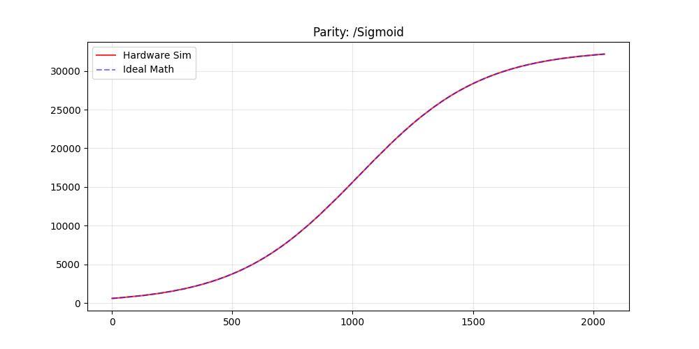
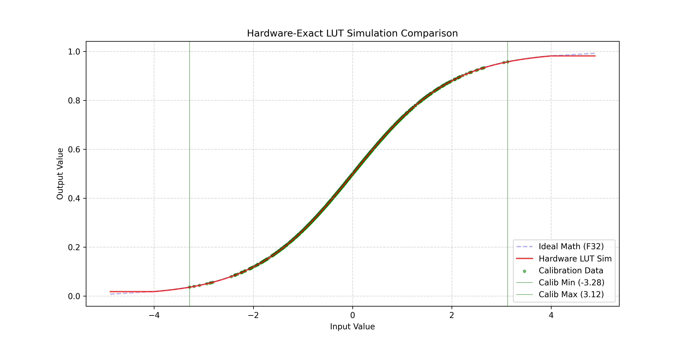
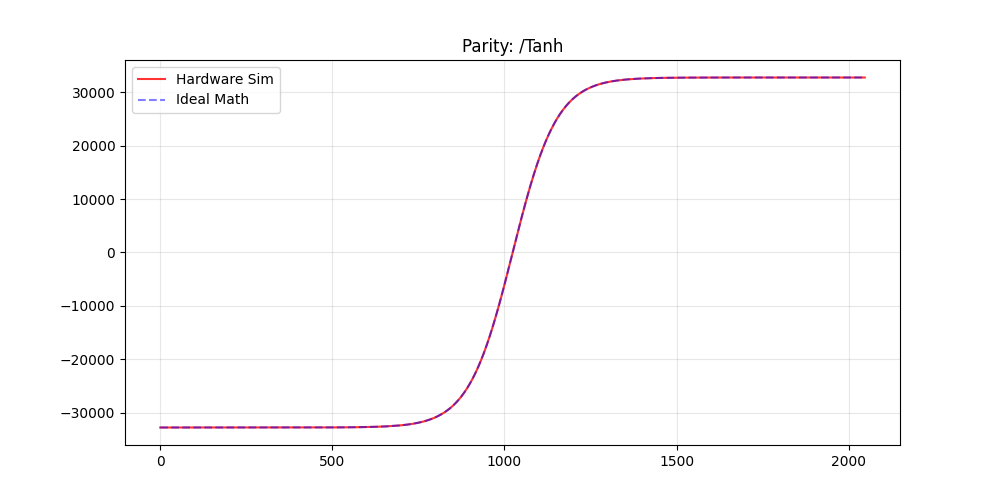
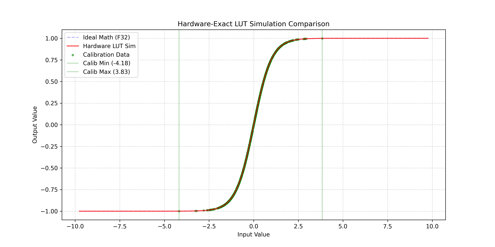
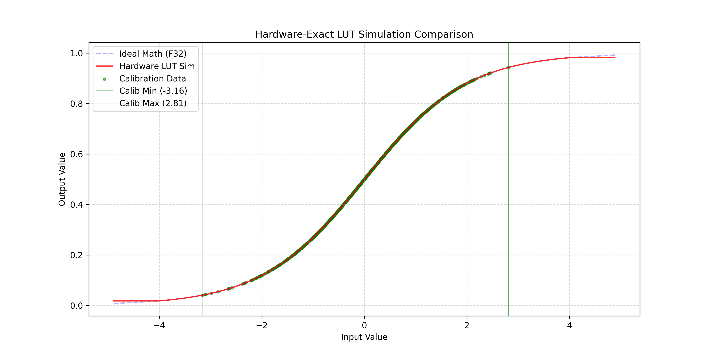
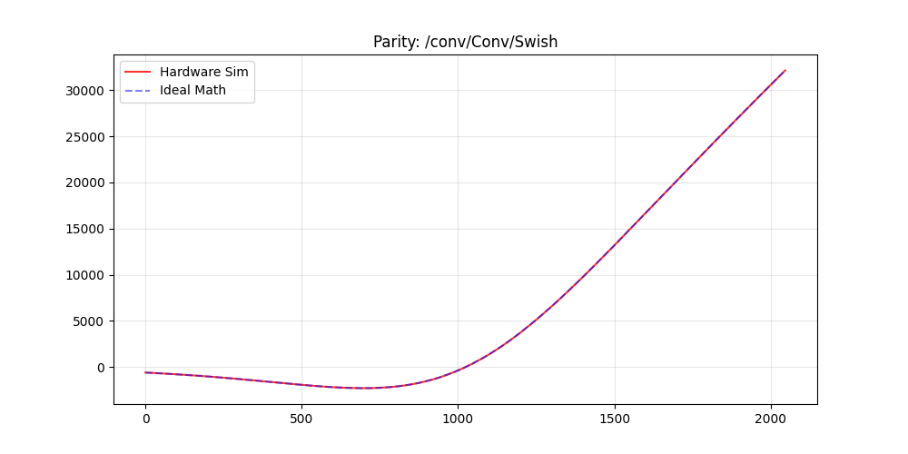
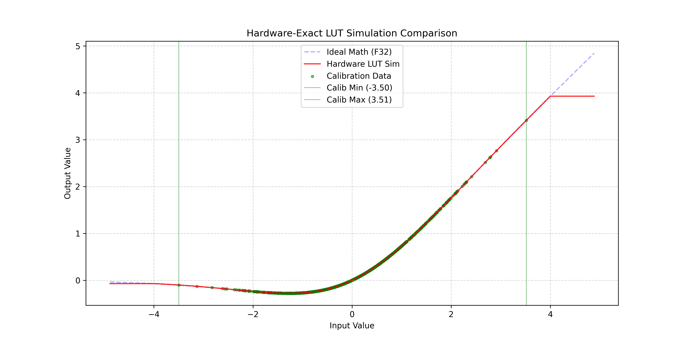
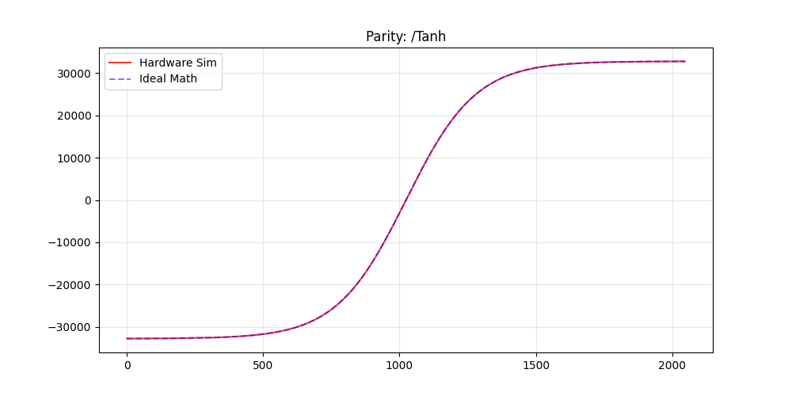
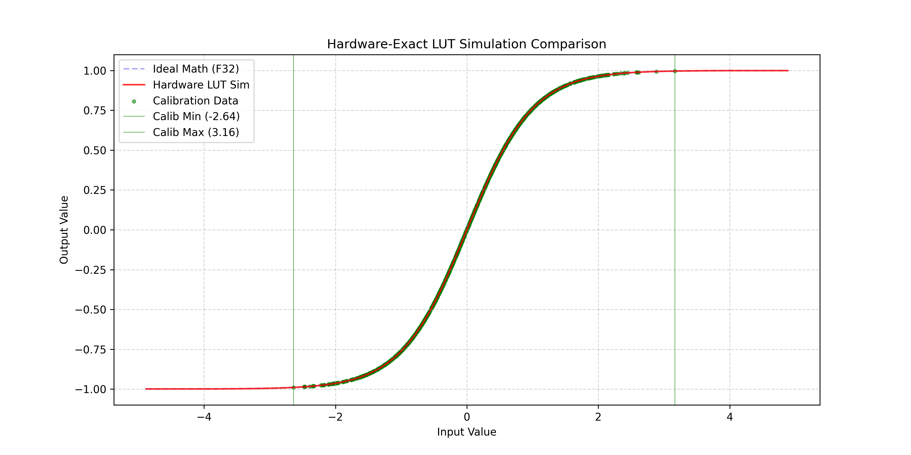

# ESP-PPQ LUT Bit-Exact LUT Activation Deployment for ESP32

> **A Python extension library for [esp-ppq](https://github.com/espressif/esp-ppq) that enables bit-exact Look-Up Table (LUT) based activation functions for INT16 quantized neural networks on ESP32-P4 and ESP32-S3.**

<p align="center">
  
</p>

<p align="center"><em>Exhaustive INT16 sweep (65,536 points)  Python Hardware Simulation vs Ideal F32 Math for Swish/SiLU</em></p>

---

## Table of Contents

- [Motivation  Why This Exists](#motivation--why-this-exists)
  - [The YOLO26n Deployment Challenge](#the-yolo26n-deployment-challenge)
  - [The Simulation Gap](#the-simulation-gap)
  - [The Fencepost Bug](#the-fencepost-bug)
- [The Solution](#the-solution)
- [Architecture Overview](#architecture-overview)
- [How It Works  The Full Pipeline](#how-it-works--the-full-pipeline)
  - [Phase 1: Library Initialization](#phase-1-library-initialization)
  - [Phase 2: Quantization & Graph Rewriting](#phase-2-quantization--graph-rewriting)
  - [Phase 3: Bit-Exact Hardware Emulation](#phase-3-bit-exact-hardware-emulation)
  - [Phase 4: Context-Aware Export](#phase-4-context-aware-export)
  - [Phase 5: Verification  Python vs Hardware](#phase-5-verification--python-vs-hardware)
- [Key Technical Concepts](#key-technical-concepts)
  - [INT16 LUT Interpolation on ESP-DL](#int16-lut-interpolation-on-esp-dl)
  - [The 2049-Point Table (Fencepost Fix)](#the-2049-point-table-fencepost-fix)
  - [The Dual-Mode Execution Engine](#the-dual-mode-execution-engine)
- [Supported Activation Functions](#supported-activation-functions)
- [Verification Results](#verification-results)
  - [ESP32-P4](#esp32-p4)
  - [ESP32-S3](#esp32-s3)
  - [Firmware Validation Logs](#firmware-validation-logs)
- [Project Structure](#project-structure)
- [Getting Started](#getting-started)
  - [Prerequisites](#prerequisites)
  - [Quick Start  Single Activation](#quick-start--single-activation)
  - [Full Test Suite  All Activations](#full-test-suite--all-activations)
  - [Firmware Validation on Real Hardware](#firmware-validation-on-real-hardware)
- [API Reference](#api-reference)
- [Repository History](#repository-history)
- [Related Work](#related-work)
- [License](#license)

---

## Motivation  Why This Exists

### The YOLO26n Deployment Challenge

This library was born out of a real deployment problem encountered while bringing **[YOLO26n](https://github.com/BoumedineBillal/yolo26n_esp)**  a hardware-optimized YOLO architecture  to the **ESP32-P4** and **ESP32-S3** via the [esp-dl](https://github.com/espressif/esp-dl) inference framework ([PR #286](https://github.com/espressif/esp-dl/pull/286)).

YOLO26n uses a **One-to-One (NMS-free) detection head** with `RegMax=1` direct regression, achieving **1.3x faster inference** than YOLOv11n. However, this architectural simplicity makes the head **extremely sensitive to quantization noise**  especially in the bounding box regression branches.

The journey to solve this revealed a chain of precision challenges:

| Attempt | Approach | Accuracy | Latency | Problem |
|---------|----------|----------|---------|---------|
| 1 | Standard INT8 (all layers) | ❌ Very low mAP | ✅ Fast | Classification OK, but regression destroyed |
| 2 | Mixed: INT16 Conv + INT8 Activation | ❌ Still low | ✅ Fast | INT8 Swish acts as precision bottleneck between INT16 conv layers |
| 3 | INT16 Conv + INT16 Swish (naive) | ✅ Good mAP | ❌ **~660ms/layer** | ESP-DL falls through to: `dequant → float32 Swish → requant` |
| 4 | **INT16 LUT with interpolation** | ✅ Good mAP | ✅ Small overhead | **This library — Hardware-accelerated, 4KB per table** |

The critical finding: **INT16 Swish was necessary for accuracy, but the only fast path on ESP-DL is the LUT with linear interpolation**. A brute-force INT16 LUT (2¹⁶ × 2 bytes = 128KB per layer) is too large. Instead, ESP-DL supports a **compressed 4KB LUT** (2,049 entries × step size 32) with hardware-accelerated linear interpolation between entries.

### The Simulation Gap

This created a fundamental simulation problem in `esp-ppq`:

| Mode | What PPQ Simulates | What ESP-DL Actually Computes | Match? |
|------|-------------------|-------------------------------|--------|
| INT8 Activation | All 256 possible values evaluated | Direct LUT (256 entries) | ✅ Automatic match |
| **INT16 LUT (step > 1)** | Standard float activation on dequantized input | Stepped LUT + **integer truncated linear interpolation** | ❌ **Mismatch** |

For INT8, `esp-ppq`'s forward pass is automatically equivalent to the ESP-DL LUT because every possible input has a direct table entry. But for **INT16 with step > 1**, the LUT + interpolation behavior diverges from the standard activation forward  **what PPQ validates is not what the MCU actually computes.**

This means:
1. **Accuracy metrics in Python are unreliable**  they don't reflect the actual interpolation error
2. **QAT (Quantization-Aware Training) cannot learn to compensate**  the training loop doesn't see the real hardware behavior
3. **Debugging requires physical hardware**  no way to reproduce on-chip errors in Python

### The Fencepost Bug

During development, this library also uncovered a **critical off-by-one bug** in `esp-ppq`'s LUT exporter ([documented in esp-dl PR #286](https://github.com/espressif/esp-dl/pull/286)):

The ESP-DL runtime uses linear interpolation which requires `N+1` boundaries for `N` segments:

```
// esp-dl/dl/module/include/dl_module_lut.hpp (lines 79-80)
int x = table_ptr[idx];
int y = table_ptr[idx + 1];  // ← Requires index idx+1 to exist!
```

But the `esp-ppq` exporter generated only `N` entries:

```python
# esp-ppq/parser/espdl/export_patterns.py (line 647)  THE BUG
input = torch.arange(min, max + 1, step=step, dtype=torch.float)  # Generates 2048 points
```

For the maximum INT16 input of `32767`:
- `idx = (32767 + 32768) / 32 = 2047` → `table_ptr[2047]` ✅ Legal
- `table_ptr[2048]` ❌ **Out-of-bounds read**  the MCU reads garbage from the next memory region

**Observed effect**: Correct outputs for negative/low-positive inputs, but a characteristic "dip" or corruption at the positive edge of the activation function (e.g., output of `1060` instead of expected `32177` for Swish at high positive values).

**The fix** (adopted by the `esp-ppq` maintainers via [@sun-xiangyu](https://github.com/sun-xiangyu)):

```diff
- input = torch.arange(min, max + 1, step=step, dtype=torch.float)   # 2048 points
+ input = torch.arange(min, max + step, step=step, dtype=torch.float) # 2049 points ✅
```

This is the **universal fix** it works correctly for both INT8 direct mapping (`step=1` → 256 points) and INT16 interpolated mode (`step=32` → 2,049 points).

---

## The Solution

**`esp_ppq_lut`** is a drop-in extension library for `esp-ppq` that creates a **"Digital Twin"** of the ESP-DL LUT hardware in Python. It achieves **100% bit-exact parity** between the Python simulation and the actual ESP32 hardware execution across the entire INT16 input range (65,536 values).

The library:

- **Emulates** the ESP-DL fixed-point LUT interpolation formula: `output = x + trunc(remainder × (y − x) / step)`
- **Rewrites** the computation graph to replace activation ops with `LUT` nodes (graph fusion pass)
- **Manages** a dual-mode execution context (Ideal Math for table generation, Hardware Simulation for validation)
- **Supports QAT**  the emulator implements `torch.autograd.Function` with a Straight-Through Estimator (STE) backward pass, enabling Quantization-Aware Training with faithful hardware behavior in the forward pass
- **Exports** hardware-ready `.espdl` model files with correct LUT tables
- **Verifies** parity automatically with exhaustive 65,536-point sweeps and visual plots
- **Generates** C headers and `.espdl` binaries for direct firmware validation

---

## Architecture Overview

```
┌─────────────────────────────────────────────────────────────────────┐
│                    esp_ppq_lut Extension                            │
│                                                                     │
│  ┌──────────┐  ┌──────────┐  ┌──────────┐  ┌─────────┐            │
│  │ patches  │  │ emulator │  │  passes  │  │exporter │            │
│  │          │  │          │  │          │  │         │            │
│  │ Fix      │  │ Bit-Exact│  │ Graph    │  │ Mode-   │            │
│  │ Backend  │──│ Hardware │──│ Rewrite  │──│ Aware   │            │
│  │ Tables   │  │ LUT Sim  │  │ Fusion   │  │ Export  │            │
│  └──────────┘  └──────────┘  └──────────┘  └─────────┘            │
│       │              │             │              │                 │
│  ┌────┴──────────────┴─────────────┴──────────────┴─────┐          │
│  │                  utils  +  verifier                   │          │
│  │  LUT Table Generation, Numerical Verification,        │          │
│  │  C Header Export, Comparison Plots, JSON Manifests     │          │
│  └───────────────────────────────────────────────────────┘          │
└─────────────────────────────────────────────────────────────────────┘
                          │
                          ▼
              ┌───────────────────────┐
              │     esp-ppq (PPQ)     │
              │  Quantization Engine  │
              └───────────────────────┘
                          │
                          ▼
              ┌───────────────────────┐
              │      ESP-DL Runtime   │
              │ ESP32-P4 / ESP32-S3   │
              └───────────────────────┘
```

---

## How It Works  The Full Pipeline

### Phase 1: Library Initialization

```python
import esp_ppq_lut as esp_lut

esp_lut.initialize(step=32, verbose=True)
```

A single call to `initialize()` performs three critical global registrations:

| Step | Module | What It Does |
|------|--------|-------------|
| 1 | `patches.py` | Registers standalone `Sigmoid`, `Tanh`, and `Relu` forward functions into `esp-ppq`'s `DEFAULT_BACKEND_TABLE`, bypassing the library's built-in `UnaryEltwise` type-checking that would otherwise prevent LUT simulation from finding the "mathematical truth" |
| 2 | `emulator.py` | Registers the `LUT` operation type into all platform dispatch tables in `OPERATION_FORWARD_TABLE`, routing all LUT execution through the dual-mode `lut_forward_provider` |
| 3 | `exporter.py` | Replaces the default `EspdlExporter` for all ESP-DL platforms with `HardwareAwareEspdlExporter`, which automatically manages the Simulation↔Ideal Math context switch during export |

### Phase 2: Quantization & Graph Rewriting

After standard `esp-ppq` quantization (calibration, scale computation, etc.), the **`EspdlLUTFusionPass`** performs a "topology swap" on the computation graph:

```python
deployment_pipeline = PFL.Pipeline([
    esp_lut.EspdlLUTFusionPass(
        target_ops=['Swish', 'Sigmoid', 'Tanh'],
        verify=True,
        output_dir="outputs",
        lut_step=32
    )
])
deployment_pipeline.optimize(graph=graph, ...)
```

For each target activation operation, the fusion pass:

1. **Validates compatibility**  Checks that the operation targets an INT16 ESP-DL platform and has valid quantization configuration
2. **Stores shadow attributes**  Saves `original_op_type` (e.g., `'Swish'`) and `int16_lut_step` (e.g., `32`) into the operation's attribute dictionary
3. **Renames the operation**  Changes `op.type` from `'Swish'` to `'LUT'`
4. **Self-audits (optional)**  Generates the LUT table in both Ideal Math and Simulation modes and runs a bit-exact parity check between them

### Phase 3: Bit-Exact Hardware Emulation

The core of the library is the **`HardwareEmulator`** class — a custom `torch.autograd.Function` that replicates the ESP-DL LUT interpolation logic step-by-step:

```
Step 1: Quantize input to INT16        →  input_int = round(input / in_scale)
Step 2: Linear indexing                 →  base_idx = (input_int + 32768) // step
                                           remainder = (input_int + 32768) % step
Step 3: Find pivot real-world values    →  x_real = (base_idx * step - 32768) * in_scale
                                           y_real = x_real + step * in_scale
Step 4: Compute ideal activation        →  x_ideal = activation(x_real)
                                           y_ideal = activation(y_real)
Step 5: Quantize pivots to INT16        →  x_quant = round(x_ideal / out_scale)
                                           y_quant = round(y_ideal / out_scale)
Step 6: Fixed-point interpolation       →  output = x_quant + trunc(remainder * (y_quant - x_quant) / step)
Step 7: Rescale to float                →  result = clamp(output) * out_scale
```

This emulator is **generalized**  it does not hardcode any specific activation function. Instead, it looks up the mathematical "truth" from `DEFAULT_BACKEND_TABLE[original_op_type]` at runtime, making it trivially extensible to any new activation function.

The backward pass uses a **Straight-Through Estimator (STE)**: it computes the gradient of the *ideal* (float) activation function, allowing QAT to optimize through the quantized LUT operation without the gradient being zero everywhere.

### Phase 4: Context-Aware Export

The `HardwareAwareEspdlExporter` solves a subtle but critical problem:

- **During table generation**: The exporter's `AddLUTPattern` calls the operation's forward function to compute LUT pivot values. This **must** use Ideal Math (floating-point activation)  not the hardware emulator  because the table entries *are* the truth that the emulator will interpolate from.
- **During all other phases** (simulation, verification, training): The forward function **must** use the hardware emulator to predict actual on-chip behavior.

The exporter automatically switches modes:

```python
class HardwareAwareEspdlExporter(EspdlExporter):
    def export(self, *args, **kwargs):
        GlobalMode.set(SimulationMode.IDEAL_MATH)    # Tables get pure math
        try:
            super().export(*args, **kwargs)
        finally:
            GlobalMode.set(SimulationMode.SIMULATION)  # Everything else gets HW sim
```

### Phase 5: Verification  Python vs Hardware

Verification happens at three levels:

#### Level 1: LUT Pivot Parity (Table-Level)
During the fusion pass, the library generates the LUT table in both modes and compares every single pivot value:
- **Math Table**: `activation(pivot) → quantize → INT16 value`
- **Simulation Table**: `HardwareEmulator(pivot) → quantize → INT16 value`

If these 2,048 pivot values match exactly, the table is correct.

#### Level 2: Exhaustive Sweep (Full INT16 Range)
The `run_deep_verification()` function tests every single INT16 input value (-32,768 to +32,767), plus out-of-bound stress values:

```python
esp_lut.run_deep_verification(
    graph=graph,
    executor=executor,
    dataloader=[calibration_data],
    output_dir="outputs"
)
```

This generates:
- **Sweep plots**  Visual comparison of Hardware Simulation vs Ideal Math across the full input range
- **C headers**  `test_data.h` files containing the input/expected-output arrays for firmware validation
- **JSON manifests**  Machine-readable verification metadata (`mapping.json`)

#### Level 3: On-Device Firmware Validation
A C++ ESP-IDF application (in `tests_3_layers/firmware/`) loads the exported `.espdl` models on real ESP32 hardware, feeds the exact same test vectors, and compares outputs bit-by-bit against the Python predictions.

---

## Key Technical Concepts

### INT16 LUT Interpolation on ESP-DL

The ESP-DL runtime uses a piecewise-linear approximation for activation functions. The full INT16 input range `[-32768, 32767]` is divided into segments of `step` size (default: 32). For each segment, the runtime stores two quantized output values (the "pivots") and performs linear interpolation between them.

```
Input Range:  [-32768 ... -32736 ... -32704 ... ... ... 32735 ... 32767]
Segment:      [  seg_0  ][  seg_1  ][  seg_2  ] ... [    seg_2047     ]
Pivots:       p0        p1        p2        p3  ... p2047       p2048
```

The interpolation formula (fixed-point integer arithmetic):
```
output = pivot[base_idx] + trunc( remainder × (pivot[base_idx+1] - pivot[base_idx]) / step )
```

Key details:
- **Integer truncation** (`trunc`, not `round`) is used for the interpolation  this is a source of systematic quantization error that must be replicated exactly in simulation
- **Rounding-to-nearest-even (RNE)** is used for the initial input quantization and pivot value quantization
- **Table size**: With `step=32`, the table contains 2,049 INT16 values = **4,098 bytes (~4KB)** per activation layer  small enough for the MCU cache

### The 2049-Point Table (Fencepost Fix)

A common source of bugs in LUT implementations is the **fencepost error**. With 2,048 segments and step size 32, you need **2,049** pivot points (not 2,048).

**The Fence Analogy:**
```
✅ Correct (2049 points  what the MCU expects):

Post Indices:    0     1     2     ...     2047    2048
                 |*****|*****|*****  ...  *|*****|
Segments:           1     2     3   ...   2047   2048

❌ Bug (2048 points  what esp-ppq originally generated):

Post Indices:    0     1     2     ...     2047
                 |*****|*****|*****  ...  *|***** → [OUT OF BOUNDS READ]
Segments:           1     2     3   ...   2047     2048 ← no end boundary!
```

The original `esp-ppq` library used `torch.arange(min, max + 1, step)` which generates 2,048 points. This library corrects it to `torch.arange(min, max + step, step)` which generates the correct 2,049 points.

You can verify this in the exported `.espdl` model info:
```
%LUT_lut_0[INT16, 2049]    ← Correct: 2049 pivots for 2048 segments
```

### The Dual-Mode Execution Engine

The library maintains a global execution mode via `GlobalMode`:

| Mode | When Used | Math Used | Purpose |
|------|-----------|-----------|---------|
| `SIMULATION` | Default  Validation, PTQ, QAT/STE | Fixed-point LUT interpolation | Predict exact hardware output |
| `IDEAL_MATH` | During `.espdl` export only | Floating-point activation | Generate correct table values |

This is managed automatically by the `HardwareAwareEspdlExporter`, but can also be controlled manually:

```python
from esp_ppq_lut import set_simulation_mode, SimulationMode

set_simulation_mode(SimulationMode.IDEAL_MATH)   # Pure math
set_simulation_mode(SimulationMode.SIMULATION)    # Hardware emulation
```

---

## Supported Activation Functions

| Activation | ONNX Op / PPQ Type | LUT Support | Verified |
|:----------:|:-----------------:|:-----------:|:--------:|
| **Swish / SiLU** | `Swish` | ✅ | ✅ Bit-Exact |
| **Sigmoid** | `Sigmoid` | ✅ | ✅ Bit-Exact |
| **Tanh** | `Tanh` | ✅ | ✅ Bit-Exact |
| **ReLU** | `Relu` | Backend patched | N/A (not a LUT candidate) |

Adding a new activation function requires only:
1. Register its forward function in `patches.py`
2. Add its name to the `target_ops` list in `EspdlLUTFusionPass`

---

## Verification Results

### ESP32-P4

**Sigmoid  Pivot Parity Check (2,048 pivot values, Simulation vs Ideal Math):**

<p align="center">
  
</p>

**Sigmoid  Exhaustive INT16 Sweep (65,536+ points, Hardware Sim vs Ideal F32):**

<p align="center">
  
</p>

**Swish  Pivot Parity Check:**

<p align="center">
  
</p>

**Swish  Exhaustive INT16 Sweep:**

<p align="center">
  
</p>

**Tanh  Pivot Parity Check:**

<p align="center">
  
</p>

**Tanh  Exhaustive INT16 Sweep:**

<p align="center">
  
</p>

### ESP32-S3

**Sigmoid  Pivot Parity & Exhaustive Sweep:**

<p align="center">
  
  
</p>

**Swish  Pivot Parity & Exhaustive Sweep:**

<p align="center">
  
  
</p>

**Tanh  Pivot Parity & Exhaustive Sweep:**

<p align="center">
  
  
</p>

### Firmware Validation Logs

Real hardware test results confirming 100% bit-exact match between Python simulation and ESP-DL execution:

**ESP32-S3:**
```
I (922) LUT_VALIDATION: ==========================================================
I (932) LUT_VALIDATION:    Starting Multi-Layer LUT Validation Loop
I (942) LUT_VALIDATION:    TARGET: ESP32-S3
I (942) LUT_VALIDATION: ==========================================================
I (962) LUT_VALIDATION: Testing Layer: Swish
I (1072) LUT_VALIDATION:   ✅ SUCCESS: Swish matches 100% (Bit-Exact)
I (1072) LUT_VALIDATION: Testing Layer: Sigmoid
I (1182) LUT_VALIDATION:   ✅ SUCCESS: Sigmoid matches 100% (Bit-Exact)
I (1192) LUT_VALIDATION: Testing Layer: Tanh
I (1302) LUT_VALIDATION:   ✅ SUCCESS: Tanh matches 100% (Bit-Exact)
I (1302) LUT_VALIDATION: Validation Suite Finished.
```

**ESP32-P4:**
```
I (1483) LUT_VALIDATION: ==========================================================
I (1493) LUT_VALIDATION:    Starting Multi-Layer LUT Validation Loop
I (1503) LUT_VALIDATION:    TARGET: ESP32-P4
I (1503) LUT_VALIDATION: ==========================================================
I (1523) LUT_VALIDATION: Testing Layer: Swish
I (1573) LUT_VALIDATION:   ✅ SUCCESS: Swish matches 100% (Bit-Exact)
I (1573) LUT_VALIDATION: Testing Layer: Sigmoid
I (1623) LUT_VALIDATION:   ✅ SUCCESS: Sigmoid matches 100% (Bit-Exact)
I (1623) LUT_VALIDATION: Testing Layer: Tanh
I (1673) LUT_VALIDATION:   ✅ SUCCESS: Tanh matches 100% (Bit-Exact)
I (1683) LUT_VALIDATION: Validation Suite Finished.
```

> **Result: 6/6 tests pass  100% bit-exact match across all 3 activation functions on both ESP32-P4 and ESP32-S3.**

---

## Project Structure

```
esp_ppq_lut/
│
├── src/                              # Main Library & Entry Point
│   ├── esp_ppq_lut/                  # The Extension Package
│   │   ├── __init__.py               # Entry point: initialize()
│   │   ├── emulator.py               # Bit-exact HardwareEmulator (torch.autograd.Function)
│   │   ├── exporter.py               # HardwareAwareEspdlExporter (dual-mode context mgmt)
│   │   ├── passes.py                 # EspdlLUTFusionPass (graph rewriting + self-audit)
│   │   ├── patches.py                # Backend table patches (Sigmoid, Tanh, Relu forwarders)
│   │   ├── utils.py                  # LUT table generation, plots, C headers, manifests
│   │   └── verifier.py               # Exhaustive 65K-point deep verification
│   ├── main.py                       # Single-activation deployment example (Swish)
│   └── outputs/                      # Generated artifacts (ONNX, .espdl, plots, .info)
│
├── tests_3_layers/                   # Multi-Activation Validation Suite
│   ├── common.py                     # Shared test infrastructure & model definitions
│   ├── run_all.py                    # Test runner (executes all 3 tests sequentially)
│   ├── test_swish.py                 # Swish validation test
│   ├── test_sigmoid.py               # Sigmoid validation test
│   ├── test_tanh.py                  # Tanh validation test
│   ├── outputs/                      # Generated verification plots & artifacts
│   │   ├── p4/                       # ESP32-P4 target outputs
│   │   │   ├── swish_test/
│   │   │   ├── sigmoid_test/
│   │   │   └── tanh_test/
│   │   └── s3/                       # ESP32-S3 target outputs
│   │       ├── swish_test/
│   │       ├── sigmoid_test/
│   │       └── tanh_test/
│   └── firmware/                     # ESP-IDF Firmware Validation App
│       ├── CMakeLists.txt
│       ├── main/
│       │   ├── main.cpp              # C++ validation loop (loads .espdl, compares outputs)
│       │   ├── models/               # Target-specific .espdl model binaries
│       │   └── test_data/            # Generated C headers with golden vectors
│       ├── sdkconfig.defaults.esp32p4
│       ├── sdkconfig.defaults.esp32s3
│       ├── partitions.csv
│       └── firmware_tests_results.txt
│
└── prototypes/                       # Original Research Prototype
    └── validate_lut.py               # Monolithic proof-of-concept (Swish-only, monkey-patching)
```

---

## Getting Started

### Prerequisites

- **Python 3.8+** with PyTorch
- **[esp-ppq](https://github.com/espressif/esp-ppq)**  Espressif's fork of PPQ for quantization
- **[ESP-IDF](https://docs.espressif.com/projects/esp-idf/en/latest/esp32p4/get-started/)** v5.x (for firmware validation only)
- **[esp-dl](https://github.com/espressif/esp-dl)**  Deep Learning inference library for ESP32 (firmware dependency)

### Quick Start  Single Activation

```bash
# From the root directory
cd src
python main.py
```

This will:
1. Create a minimal model with a Swish activation
2. Quantize it to INT16
3. Fuse the Swish into a LUT node with automatic parity checking
4. Run the exhaustive 65K-point sweep verification
5. Export the `.espdl` model file

Outputs will be in `src/outputs/`.

### Full Test Suite  All Activations

```bash
# Run all three activation tests (Swish, Sigmoid, Tanh)
cd tests_3_layers
python run_all.py
```

This generates:
- Parity plots for each activation's LUT pivot table
- Exhaustive sweep comparison plots
- C header files with test vectors
- `.espdl` model binaries

All outputs are organized under `tests_3_layers/outputs/{p4,s3}/{activation_name}/`.

### Firmware Validation on Real Hardware

After running the Python tests:

```bash
# Navigate to the firmware project
cd tests_3_layers/firmware

# Set target (choose one)
idf.py set-target esp32p4
# or
idf.py set-target esp32s3

# Build, flash, and monitor
idf.py build flash monitor
```

The firmware will:
1. Load each `.espdl` model from flash
2. Feed the generated test vectors through the ESP-DL runtime
3. Compare every output value bit-by-bit against the Python simulation's predictions
4. Report ✅ SUCCESS (Bit-Exact) or ❌ FAILURE with mismatch details

---

## API Reference

### `esp_ppq_lut.initialize(step=32, verbose=False)`
Initializes the entire extension. Must be called before any quantization or export operations.
- `step`  LUT segment size (default: 32, resulting in 2,049 pivot points)
- `verbose`  Enable detailed logging

### `esp_ppq_lut.EspdlLUTFusionPass`
A `QuantizationOptimizationPass` that rewrites the computation graph.

```python
EspdlLUTFusionPass(
    target_ops=['Swish', 'Sigmoid', 'Tanh'],  # Activation types to fuse
    verify=True,                                # Enable pivot parity self-audit
    plot=True,                                  # Generate verification plots
    output_dir="outputs",                       # Output directory
    lut_step=32,                                # Segment size
    verbose=False                               # Detailed logging
)
```

### `esp_ppq_lut.run_deep_verification(graph, executor, dataloader, output_dir, verbose)`
Performs an exhaustive 65,536-point sweep for every LUT operation in the graph. Generates sweep plots, C headers, and JSON manifests.

### `esp_ppq_lut.set_simulation_mode(mode)`
Manually controls the execution mode:
- `SimulationMode.SIMULATION`  Bit-exact hardware emulation (default)
- `SimulationMode.IDEAL_MATH`  Pure floating-point activation

---

## Repository History

This project evolved through several iterations driven by the needs of the [YOLO26n deployment](https://github.com/BoumedineBillal/yolo26n_esp):

1. **`prototypes/validate_lut.py`**  The original monolithic prototype. A single 438-line script with monkey-patching, hardcoded to Swish only. Proved the concept of bit-exact simulation but was not reusable or extensible. Born from the need to validate that INT16 LUT-based Swish could replace the prohibitively slow naive INT16 Swish in the YOLO26n detection head.

2. **`src/esp_ppq_lut/`**  The refactored library package. All monkey-patching replaced with clean registration APIs. Generalized emulator that works with any activation function. Dual-mode context management for correct table generation. STE backward pass enabling QAT integration.

3. **`tests_3_layers/`**  The validation suite. Extended to test Swish, Sigmoid, and Tanh simultaneously. Added firmware validation on real hardware. Cross-platform support for both ESP32-P4 and ESP32-S3.

---

## Related Work

- **[YOLO26n for ESP32](https://github.com/BoumedineBillal/yolo26n_esp)**  The NMS-free YOLO architecture that motivated this library. Achieves 1.3x faster inference than YOLOv11n on ESP32-P4.
- **[esp-dl PR #286](https://github.com/espressif/esp-dl/pull/286)**  The upstream pull request to integrate YOLO26n into the official ESP-DL examples, where the fencepost bug was reported and the LUT approach was proposed.
- **[esp-ppq](https://github.com/espressif/esp-ppq)**  Espressif's quantization toolkit (fork of PPQ). This library extends it with hardware-faithful LUT simulation.
- **[esp-dl](https://github.com/espressif/esp-dl)**  Espressif's deep learning inference library for ESP32 chips. Contains the LUT runtime that this library emulates.

---

## License

MIT
