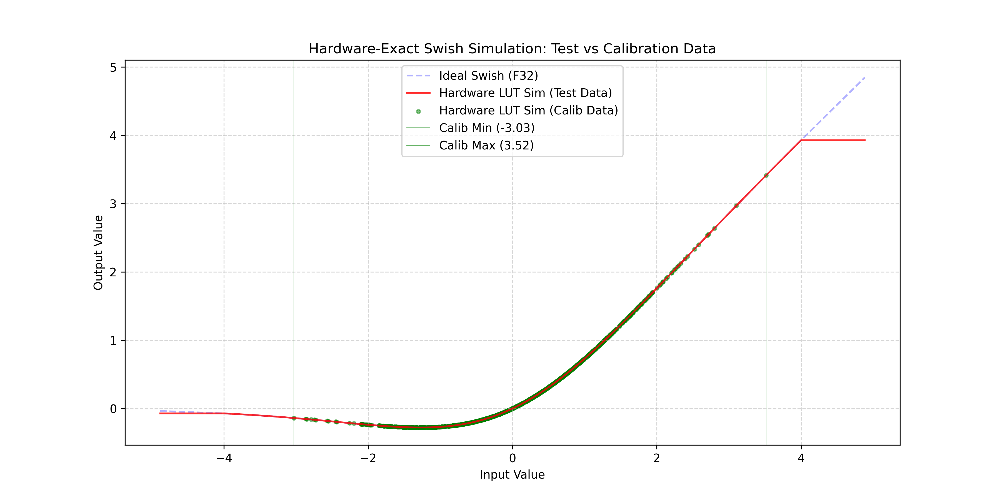

# ESP32-P4 Bit-Exact Swish LUT Validation Suite

## Abstract: The Road to 100% Hardware Parity

In standard **INT8 deployment**, Activations in `esp-dl` are calculated directly using a full table of 256 entries. This results in a 100% bit-exact match with `esp-ppq` because every possible input value is pre-calculated and stored.

However, for high-sensitivity models like **YOLOv26n**, INT8 precision is insufficient. When we "force" the deployment of an **INT16 Activation** function to a Look-Up Table (LUT), and the step size is greater than 1 (to save memory), we map the function to a smaller table that does **not** include all possible $2^{16}$ values. This necessitates **Linear Interpolation** on the chip.

This interpolation introduces a discrepancy between the standard `esp-ppq` Swish operation and the actual `esp-dl` hardware behavior. To bridge this "Gap," we developed:
1.  **Bit-Exact Forward Function**: A custom simulator in `esp-ppq` that 100% replicates the `esp-dl` LUT interpolation logic.
2.  **Straight-Through Estimator (STE)**: A custom backward path that enables training the model using the exact forward logic that will run on the silicon.

The validated workflow follows this pipeline:
1.  **PTQ**: Perform initial Post-Training Quantization with the standard Swish function.
2.  **QAT**: Fine-tune the model with standard Swish.
3.  **LUT Replacement**: Replace the INT16 Swish with our custom LUT operation (Bit-Exact Forward + Interpolation).
4.  **Final Verification/Fine-tuning**: Perform validation that is 100% aligned with hardware. If any accuracy drop is observed due to interpolation, we can use the STE to continue training and recover that accuracy while remaining bit-exact to the chip.

---

## Critical Technical Summary

*   **The Precision-Latency Paradox**: YOLOv26n requires INT16 precision, but standard software-calculated Swish causes a **660ms+ latency spike** per layer.
*   **The Fencepost Resolution**: Includes a global patch for `esp-ppq` to generate **2049 pivot points**, preventing out-of-bounds memory reads during hardware interpolation.
*   **Hardware Efficiency**: The 4KB design fits within the L1 cache, bypassing the costly `Float -> Swish -> INT16` software fallback.

---

## 📖 The Narrative: Journey to Precision

### 1. The Sensitivity Bottleneck
The One-to-One (o1o) detection head in YOLOv26n is extremely sensitive to quantization noise. Standard **INT8 QAT** resulted in significantly low mAP. Even with **Mixed Precision (INT16 Conv Only)**, accuracy did not recover because the INT8 activations remained a bottleneck, stripping away the precision gained by the INT16 weights.

### 2. The Discovery of the 660ms Spike
Enabling pure **INT16 Activations** recovered the mAP but introduced massive latency. Profiling revealed that INT16 Swish is not hardware-accelerated. The ESP-DL library performs a software sequence (`Dequantize -> Math -> Quantize`) taking up to **666ms per layer**.

### 3. The Gap: Interpolation Noise
> [!IMPORTANT]
> **Why we need the Digital Twin**
>
> When we use a Step Size of 32, we only store 2,048 pivot points. For every input in between these points, the hardware "guesses" the value using linear interpolation. 
> 
> Because this approximation differs from the pure mathematical Swish forward pass used in standard PPQ, there is a "Gap" in validation. Without a bit-exact simulator, you might observe high accuracy in Python but suffer "surprise" drops on-chip. Our **Digital Twin** eliminates this gap by allowing the model to "see" and "train against" the hardware's interpolation noise before it reaches the silicon.

---

## The Implementation & Workflow

### Hardware-Exact Simulation (Forward)
We reverse-engineered the `esp-dl` source code to match:
- **Rounding Mode**: Round-half-to-even behavior.
- **Integer Math**: Integer-truncation division for the interpolation fraction.
- **Boundary Handling**: Correct index calculation for the 2049th pivot point.

### Training with STE (Backward)
Even if replacing the ideal Swish with the Interpolated LUT causes a slight accuracy drop, the **Straight-Through Estimator (STE)** enables the model to be further optimized. The backward pass remains continuous, allowing typical gradient descent to compensate for any quantization or interpolation artifacts produced by the discrete hardware LUT.

---

## Visual Proof

### High-Fidelity Swish Comparison
The simulator ensures the hardware-accelerated LUT (Red) perfectly tracks the mathematical Ideal (Blue) at the model's calibrated scale.



### Pivot Entry Verification
We verify survival of every pivot point. The plot confirms 100% bit-exact parity between the Python generator and the ESP32 silicon behavior for all reachable entries.


---

## The Digital Twin: Implementation & Theory

The core of this validation suite is the `HardwareLUT` autograd function, which serves as a microscopic simulation of the ESP32-P4's silicon logic.

```python
class HardwareLUT(torch.autograd.Function):
    @staticmethod
    def forward(ctx, input_tensor, in_scale, out_scale, step, rounding):
        ctx.save_for_backward(input_tensor)
        # 1. Hardware Input Quantization
        input_int = ppq_tensor_round(input_tensor / in_scale, rounding)
        input_signed = torch.clamp(input_int, -32768, 32767)

        # 2. Segment Indexing (ESP32-P4 logic)
        idx_shifted = input_signed + 32768
        base_idx = idx_shifted // step
        remainder = idx_shifted % step

        # 3. Pivot Point Mapping
        x_int = (base_idx * step) - 32768
        x_real = x_int * in_scale
        x_swish = x_real * torch.sigmoid(x_real) 

        y_int = x_int + step
        y_real = y_int * in_scale
        y_swish = y_real * torch.sigmoid(y_real)

        # 4. Table Value Quantization
        x = ppq_tensor_round(x_swish / out_scale, rounding).clamp(-32768, 32767)
        y = ppq_tensor_round(y_swish / out_scale, rounding).clamp(-32768, 32767)

        # 5. Fixed-Point Linear Interpolation
        output_quant = x + torch.trunc((remainder * (y - x)) / step)
        return output_quant.clamp(-32768, 32767) * out_scale

    @staticmethod
    def backward(ctx, grad_output):
        # Straight-Through Estimator (STE) using continuous Swish derivative
        input_tensor, = ctx.saved_tensors
        sig = torch.sigmoid(input_tensor)
        swish_grad = sig * (1 + input_tensor * (1 - sig))
        return grad_output * swish_grad, None, None, None, None
```

### Technical Breakdown:
- **The Forward Pass**: This implementation mirrors the ESP-DL library's C++ code. It handles segment indexing and uses `torch.trunc` for the remainder calculation to match the hardware's integer division exactly.
- **The Backward Pass (STE)**: Quantized Look-Up Tables are non-differentiable (gradients are zero or undefined). We use the mathematical derivative of the Swish function as a **Straight-Through Estimator**. This "tricks" the optimizer during QAT, allowing the model to learn how to adjust its weights to account for the specific interpolation noise of the hardware.

---

## Why Separated Table Generation & Simulation are Essential

We have pivoted from a unified simulation to a **Separated Forward Path** strategy. The LUT generation (Export) utilizes the pure mathematical function, while the Inference simulation (Digital Twin) utilizes the hardware logic.

### 1. The Interpolation Coverage Requirement
LUT pivots represent the "nodes" of the function. Many of these pivots (such as $x=32768$ in our step-32 INT16 design) are **physically unreachable** in the hardware integer domain (which caps at 32767).

However, these unreachable pivots **must exist** in the `.espdl` table. Why? Because the hardware needs them to calculate the slope for linear interpolation. If the input is $32767$, the hardware looks at the interval $[32736, 32768]$. If the 2049th pivot ($32768$) were missing or "quantized out" by the simulator during export, the hardware would perform an out-of-bounds read or use a zeroed-out memory slot, leading to a catastrophic mismatch.

### 2. Guarding the Ground Truth
By generating the LUT table with **Ideal Math** (`USE_BIT_EXACT_SIMULATION = False`), we ensure that the hardware has the most accurate possible "anchor points."

By running the inference simulation with the **Digital Twin** (`USE_BIT_EXACT_SIMULATION = True`), we ensure that the Python model exactly predicts how the chip will truncate fractions and handle segments during real-time decoding.

This decoupling is what enables **100% Bit-Exact Parity** across the entire 65,536-point INT16 spectrum.

---

---

## Test Data Selection & Exhaustive Verification

To move beyond the "happy path" and achieve empirical proof of parity, the validation suite employs an **Exhaustive Sweep** strategy:

### 1. The 65,536-Point Spectrum
We generate 65,536 float inputs that exactly map to every possible INT16 integer value from `-32768` to `32767`. This ensures that every segment, every pivot, and every interpolation remainder (0–31) is struck and verified.

### 2. Boundary & Out-of-Bounds (OOB) Coverage
We explicitly include values at `±40000.0 * scale` to verify the hardware's saturation and clamping logic. This confirms the silicon correctly caps the activation at the ceiling/floor rather than wrapping around (overflowing).

### 3. Firmware Loop Alignment
The test data is padded to a multiple of **1024** ($32 \times 32$). This allows the firmware to verify the entire 65k range in a loop of 65 discrete inference passes, strictly matching the model's fixed memory layout while traversing the complete dynamic range.

---

## The Identity Conv2D Anchor

In the validation model, we place an **Identity Conv2D** (weight=1.0, bias=None) immediately before the activation. This is required for the `esp-ppq` export engine:

1.  **Swish Detection**: The pattern matcher in `esp-ppq` specifically searches for a `Conv2D` followed by the mathematical sequence `x * sigmoid(x)`. When this sequence is detected, it automatically converts the activation into a **Swish operation**.
2.  **Quantization Stability**: Anchoring the activation to a convolution ensures it has a dedicated `input_quant_config`, allowing precise control over the input scale to match production YOLOv26n conditions.

---

## Usage Instructions

1.  **Run Validation**:
    ```bash
    python validate_lut.py
    ```
2.  **Verify Parity**:
    Ensure the console logs show `Match %: 100.00%`.
3.  **Deployment**:
    - Copy `outputs/swish_lut_test.espdl` for model loading.
    - Reference `outputs/test_data.h` in your firmware to verify bit-exact outputs.

---

*Authored for the YOLO26n High-Precision ESP32-P4 Deployment Initiative.*
